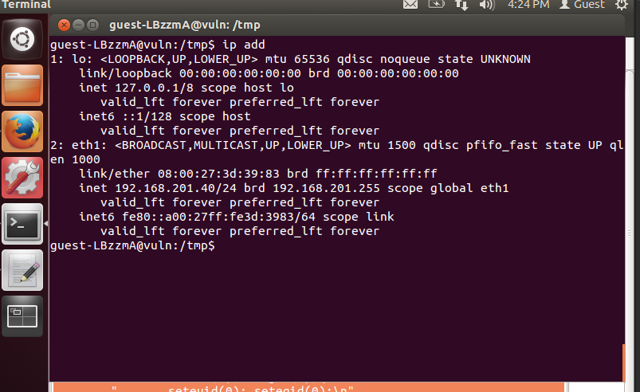

# Challenge 1 - Gain Access to a Remote

**first i installed the vm and login as guest**
and Check the ip address of the vm



I opened the site 


After login i found it is a simple notes taking site 

**also i found it is a site written on php**


**first i check that i have any writable permission in the ```/var/www``` directory because if i have i can make a php script to read the content of /root**

After searching on google i found
```bash
find . -type f -writable 2>/dev/null

```
**But i found nothing**


**I did not know what to do after it so i just looking for common attacks like SQL injection or XSS and others**


**and i see the site is vulnerable to XSS**


**so i write a php script to read the content of /root/file and alert the ouput**

```php
<?php

$file_path = '/root/file.txt';


if (file_exists($file_path) && is_readable($file_path)) {

$content = file_get_contents($file_path);


$escaped_content = addslashes($content);
} else {
$escaped_content = "Cannot access the file!";
}
?>
<!DOCTYPE html>
<html lang="en">
<head>
<meta charset="UTF-8">
<meta name="viewport" content="width=device-width, initial-scale=1.0">
<title>File Content</title>
</head>
<body>
<script>

var fileContent = "<?php echo $escaped_content; ?>";
alert(fileContent);
</script>
</body>
</html>
```


**but no output come**


**i does not understand why this happening then i search and found that**
<br>
PHP code in the input is not executed on the server because the server does not re-parse user input as PHP code. It treats it as plain text and outputs it as is.

<br>

Then i checked for any cron job running as root and if i have write permission then i can write something in it


**sadly i did not found any cron job with write permission**

#### Check for suid binary


The output shows a list of binaries with the SUID bit set, meaning they run with the permissions of their owner (usually root). Some of these are common  on Linux systems, but a few could  be exploited for privilege escalation


**then i search for pkexec version**


**yes the version 0.104 has some vulnerability i found on google**


**checking the ```README``` file i found the way to exploit it**

Since curl was not installed on the vm

I hosted a webserver on my laptop and using the ```wget``` command i installed the zip file

 

**like that 192.168.201.82 is my laptop ip**


**so i download the zip and extract it in the tmp directory because i have write permission in it so i can create my own folder and file and write something in it**


**SO AFTER running it i did not able to get the root access i dont know what to do after that**