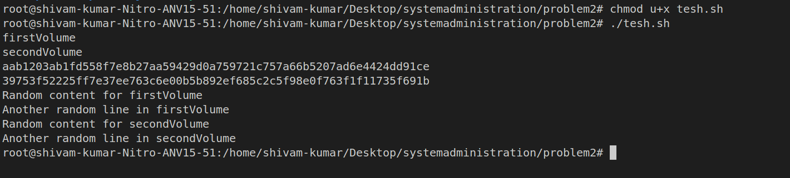
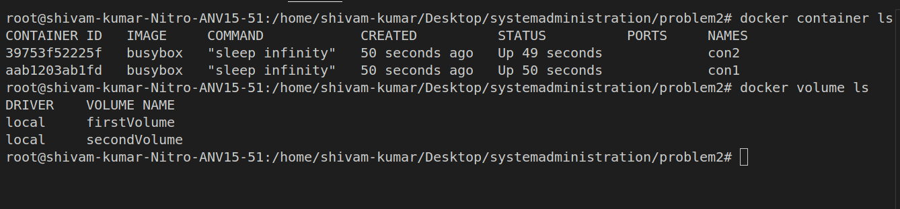
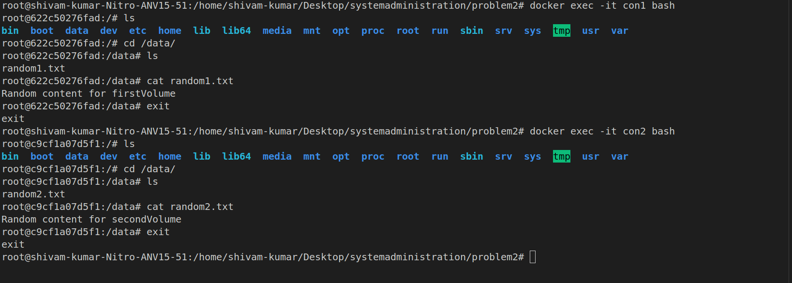
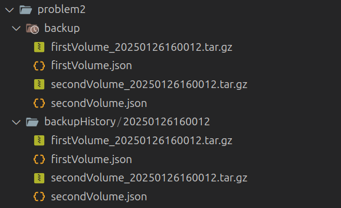
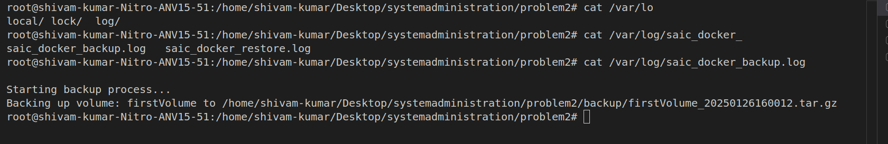
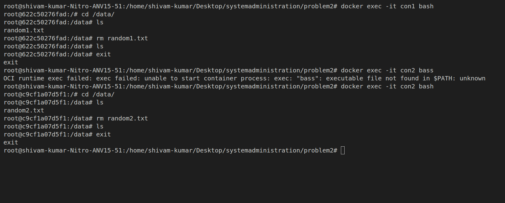
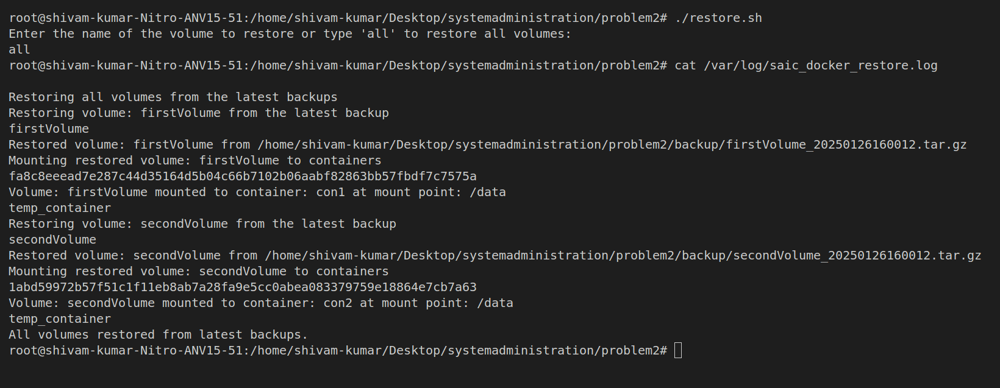
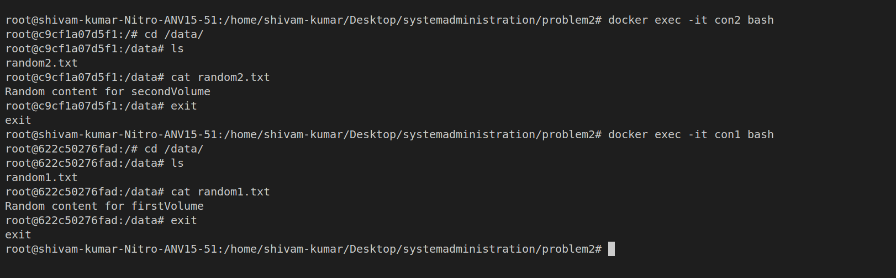

# Challenge 2 - Docker Scripting

### warning : give root permission for testing the script

### Backup Process:

I Used two directory location

- **BACKUP_DIR** this store the latest backup
- **BACKUP_HISTORY_DIR** this store the history of the backup
- **LOG_FILE** this stores the log output

The BACKUP_DIR directory store the compressed file for all the volume with timestamp

**when i did this i encountered a problem like how do i know which volume is used by which container if i does not know then how do i restore it**

So i also created a json file for each volume which store the volume name the containers which used it and the mount point where the volumes are mounted inside the container

**For Example**

```json
{
  "volume": "firstVolume",
  "containers": [{ "container": "con1", "mount_point": "/content" }]
}
```

**my problem is that i have to find all the container open or close that using a particular volume**

After little bit of searching i found

```docker
docker ps -a --filter "volume=volumeName" -format '{{.ID}}'
```

**this give the CONTAINER ID of the container used
by a particular volume**

**Now for taking backup i loop through all the volume by using `docker volume ls -q` and mount it to `/volume ` then i also mount the `BACKUP_DIR ` to `/backup` and copied the volume content to the BACKUP_DIR with timestamp**

```docker
docker run --rm -v ${volume}:/volume -v ${BACKUP_DIR}:/backup busybox tar -czf /backup/${volume}_${TIMESTAMP}.tar.gz -C /volume ./

```

**Now one problem is solved to list down all the container which using a particular volume but another change is that to find the Mounts points of a volume inside a container**

so i first created a container named con2 and a volume name secondVolume and mount it to `/content` of the container then i inspect the container

```bash
    docker inspect containerName
```

**then i found the Mounts it store the Destination where the volume is mounted and also the name of the volume**

```json
 "Mounts": [
            {
                "Type": "volume",
                "Name": "secondVolume",
                "Source": "/var/lib/docker/volumes/secondVolume/_data",
                "Destination": "/content",
                "Driver": "local",
                "Mode": "z",
                "RW": true,
                "Propagation": ""
            }
        ],
```

**Yeah! That it then i just have to used `--filter` for extracting the Name and destination of volume**

### BACKUP SCRIPT

```shell

#!/bin/bash

BACKUP_DIR=/home/shivam-kumar/Desktop/systemadministration/problem2/backup
BACKUP_HISTORY_DIR=/home/shivam-kumar/Desktop/systemadministration/problem2/backupHistory
TIMESTAMP=$(date +"%Y%m%d%H%M%S")
LOG_FILE="/var/log/saic_docker_backup.log"


DIRECTORY="backupHistory"
if [ ! -d "$DIRECTORY" ]; then
  mkdir -p "$DIRECTORY"
fi

if [ -d "$BACKUP_DIR" ]; then
  rm -r "${BACKUP_DIR}"
fi

echo "" > "${LOG_FILE}"
echo "Starting backup process..." >>"${LOG_FILE}"

docker volume ls -q | while read volume; do
    ARCHIVE_NAME="${BACKUP_DIR}/${volume}_${TIMESTAMP}.tar.gz"
    echo "Backing up volume: ${volume} to ${ARCHIVE_NAME}" >>"${LOG_FILE}"
    docker run --rm -v ${volume}:/volume -v ${BACKUP_DIR}:/backup busybox tar -czf /backup/${volume}_${TIMESTAMP}.tar.gz -C /volume ./

    containers=$(docker ps -a --filter "volume=${volume}" --format '{{.ID}}')
    container_array=()
    for container in $containers; do
        mount_point=$(docker inspect --format='{{ range .Mounts }}{{ if eq .Name "'${volume}'" }}{{ .Destination }}{{ end }}{{ end }}' $container)
        container_array+=("{\"container\": \"$(docker inspect --format='{{.Name}}' $container | cut -d'/' -f2)\", \"mount_point\": \"${mount_point}\"}")
    done

    json_content="{\"volume\": \"${volume}\", \"containers\": [$(IFS=,; echo "${container_array[*]}")]}"
    echo $json_content > "${BACKUP_DIR}/${volume}.json"
done

echo "Backup process completed." >>"${LOG_FILE}"

mkdir "${BACKUP_HISTORY_DIR}/${TIMESTAMP}"
cp -r "${BACKUP_DIR}/"*  "${BACKUP_HISTORY_DIR}/${TIMESTAMP}"


```

### TESTING SCRIPT

i also created a test script First give it root permission
<br>
it just create two volume name ```firstVolume``` and ```SecondVolume``` and two container name ``` con1``` and ```con2```

also mount the ```firstVolume``` at ```/data``` in con1 and create a file random1.txt and add some content in it
<br>
and mount the ```secondVolume``` at /data in ```con2``` and create a file random2.txt and add some content in it

## NOTE 

**please do not use   _  (underscore) for the name of the volume because i use file format for compress file is of like ``` volumeName_TIMESTAMP.tar.gz ```**

```bash
#!/bin/bash


docker volume create firstVolume

docker volume create secondVolume


docker run -d --name con1 -v firstVolume:/data ubuntu sleep infinity
docker run -d --name con2 -v secondVolume:/data ubuntu sleep infinity


docker exec con1 sh -c 'echo "Random content for firstVolume" > /data/random1.txt'


docker exec con2 sh -c 'echo "Random content for secondVolume" > /data/random2.txt'


docker exec con1 cat /data/random1.txt


docker exec con2 cat /data/random2.txt


```
**then just run the backup script**

## Restore Process
**Here i have to provide two functionalities one is we can restore all volume from the backup or we can only restore a particular volume**

so i created two function 
* ```restore_latest_volume```  this function restore only a particular volume by name
* ```restore_all_latest_volumes``` this function restore all the volume

**so if you want to restore a volume just type it name or type all to resotre all volume**

**SO for mounting the volume correctly to the container it is easy for me because in backup script i save the data of which volume is used by which container in json format**

**But the problem is that how i copy the volume data to a particular container** 

after search i found the ```docker cp ``` command to copy data from one container to another   
```docker
docker cp temp_container:/volume/. ${container}:${mount_point}
```

**Now it is done**

#### RESTORE SCRIPT
```shell
#!/bin/bash


BACKUP_DIR=/home/shivam-kumar/Desktop/systemadministration/problem2/backup
TIMESTAMP=$(date +"%Y%m%d%H%M%S")
LOG_FILE="/var/log/saic_docker_restore.log"

echo "" > "${LOG_FILE}" 

restore_latest_volume() {
    local volume=$1
    echo "Restoring volume: ${volume} from the latest backup" >> "${LOG_FILE}" 
    latest_archive=$(ls -t ${BACKUP_DIR}/${volume}_*.tar.gz | head -n 1)
    if [ -z "$latest_archive" ]; then
        echo "No backup found for volume: ${volume}" >> "${LOG_FILE}" 
        return
    fi
    docker volume create ${volume} >> "${LOG_FILE}" 
    docker run --rm -v ${volume}:/volume -v ${latest_archive}:/backup.tar.gz busybox tar -xzf /backup.tar.gz -C /volume
    echo "Restored volume: ${volume} from ${latest_archive}" >> "${LOG_FILE}" 
}

mount_volume_to_containers() {
    local volume=$1
    echo "Mounting restored volume: ${volume} to containers" >> "${LOG_FILE}" 
    json_file="${BACKUP_DIR}/${volume}.json"
    if [ ! -f "$json_file" ]; then
        echo "No JSON file found for volume: ${volume}" >> "${LOG_FILE}" 
        return
    fi

  
    docker run -d --name temp_container -v ${volume}:/volume busybox sleep infinity >> "${LOG_FILE}" 

 
    containers=$(jq -c '.containers[]' < "$json_file")
    for container_info in $containers; do
        container=$(echo "$container_info" | jq -r '.container')
        mount_point=$(echo "$container_info" | jq -r '.mount_point')
        
       
        docker cp temp_container:/volume/. ${container}:${mount_point} 2>/dev/null
        echo "Volume: ${volume} mounted to container: ${container} at mount point: ${mount_point}" >> "${LOG_FILE}" 
    done

    
    docker rm -f temp_container >> "${LOG_FILE}" 
}

restore_all_latest_volumes() {
    echo "Restoring all volumes from the latest backups" >> "${LOG_FILE}" 
    for latest_archive in $(ls -t ${BACKUP_DIR}/*.tar.gz | awk -F'_' '{print $1}' | sort -u); do
        volume=$(basename ${latest_archive} | cut -d'_' -f1)
        restore_latest_volume ${volume}
        mount_volume_to_containers ${volume}
    done
    echo "All volumes restored from latest backups." >> "${LOG_FILE}" 
}

echo "Enter the name of the volume to restore or type 'all' to restore all volumes:"
read volume_name

if [ "$volume_name" == "all" ]; then
    restore_all_latest_volumes
else
    restore_latest_volume $volume_name
    mount_volume_to_containers $volume_name
fi

```

## BONUS

open the crontab file using ```crontab -e``` command and the following

```bash
0 0 * * * /home/shivam-kumar/Desktop/finalSubmission/programmingGod-byte/chal2/backup.sh


```


* 0 0 indicates the minute and hour (midnight).

* | * * * indicates every day, every month, and every day of the week.

you can add you own path for backup sh
## DEMO

**First run the test shell script**

**Now check everying is working correctly**

<br>


**after running the backup script**



**backup logs**


#### now lets test the restore script
**for checking restore script it first  delete the content of ```/data``` diretory of both the container and then check if it restore or not**



**now lets run the restore script**



**checking if it works correctly**


## IT WORKS CORRECTLY 

