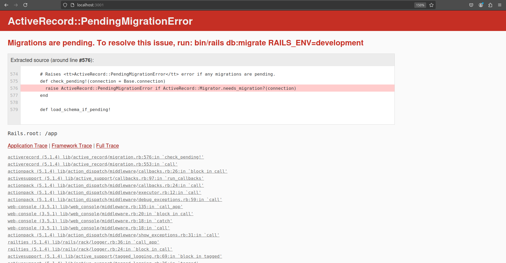
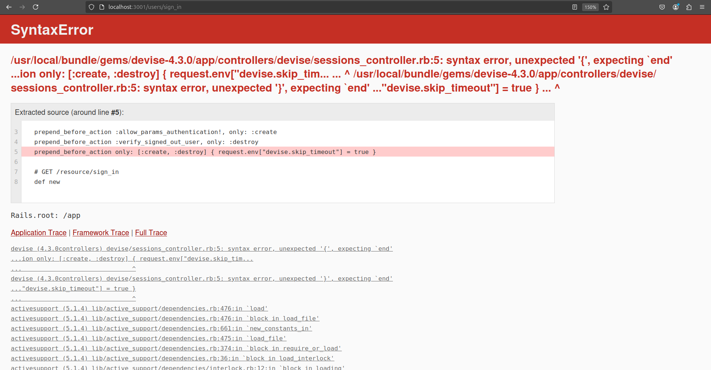
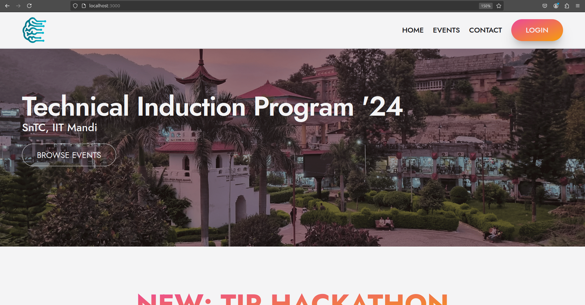
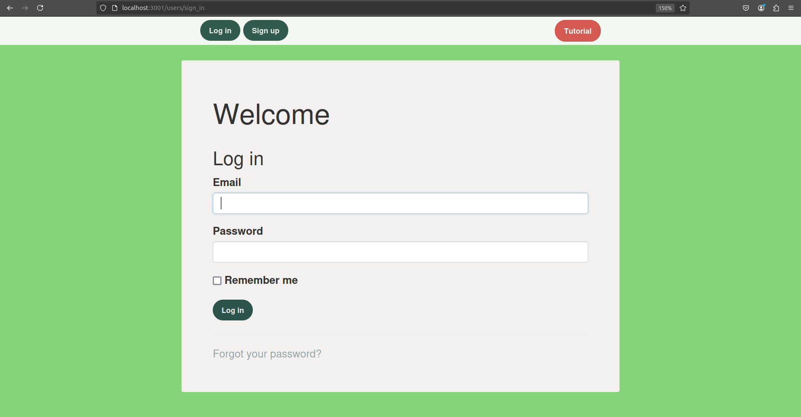
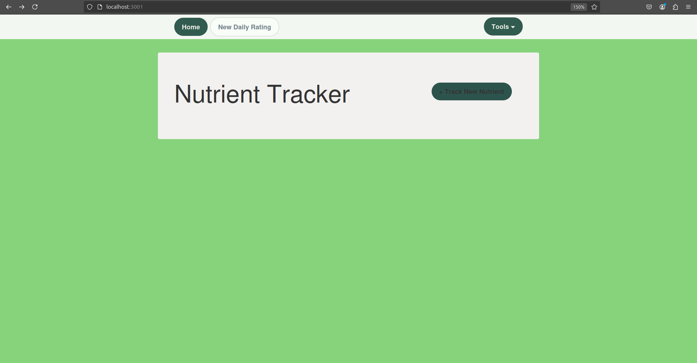
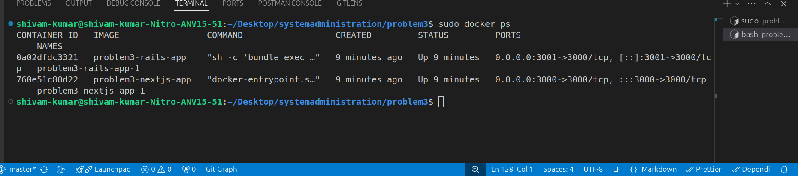

# Challenge 3 - Docker Deployments


### TIP WEBSITE

<br>

First i clone the TIP repository which is made on next js

**Found that For Next.js, Node.js version >= v18.17.0 is required**

```bash
git clone https://github.com/sntc-tech/TIP.git
```
#### dockerfile for tip website

```docker

FROM node:18-alpine


WORKDIR /app


COPY package.json package-lock.json ./


RUN npm install


COPY . .


RUN npm run build


EXPOSE 3000


CMD ["npm", "start"]

```

### Nutrient-Tracker Website

As mention it is build on ruby on rails. first i also cloned it

```bash
git clone https://github.com/aaltamirano1/Nutrient-Tracker.git
```

The repo is 8 years old. So it is little bit challenging 
When i was writing the docker file An error Occur 

`1.992 Devise.secret_key was not set. Please add the following to your Devise initializer:
1.992 
1.992   config.secret_key = 'd25f83f9890e438c5313740c3baead35493753bb116670926993360415a94db1ed3059467d5243bc8d01fb695828fc947cb3b5f6fa737632ac91e1b0fc3f4ace'`

**Then i go to the ./config/initializers/devise.rb and uncomment the secret_key**

```ruby
 # by default. You can change it below and use your own secret key.
  config.secret_key = '931e3c476373f774951be90a8f1b717ed77db417cdcbec413924dc49d8f8359084783194a5e87566474f5acfe65a9d18df9c88afe2a024922c9b7f260f914414'

```

**Also the Gemfile.lock require specific version of bundler so i also change it**

**Also in the ./config/database.yml it by default usage the sqlite 3 database**

```ruby 
test:
  <<: *default
  database: db/test.sqlite3

production:
  <<: *default
  database: db/production.sqlite3

```
**also i comment the line for Heroku because here i am using sqlite3 not pg**

```ruby
group :development do
  # Access an IRB console on exception pages or by using <%= console %> anywhere in the code.
  gem 'web-console', '>= 3.3.0'
  gem 'sqlite3'
end

#for Heroku:
# group :production do
#   gem 'pg'
#   gem 'rails_12factor'
# end

```

After doing all finally both the site open but ruby site gave an error 



**So then i found i also need to migrate the database so i again modifiy the docker file**

After migrating an error again come


This is due to an incompatibility between the Devise version i am  using and the Ruby or Rails version

**So i make some changes in the Gemfile**
```ruby
gem 'devise', '~> 4.8.0'

```

### Dockerfile for ruby app
```docker
FROM ruby:2.7-alpine

ENV RAILS_ENV=development
ENV RACK_ENV=development

RUN apk update && apk add --no-cache \
  build-base \
  nodejs \
  sqlite-dev \
  tzdata \
  yarn

RUN gem install bundler -v 1.16.0

WORKDIR /app

COPY Gemfile Gemfile.lock ./

RUN bundle install

COPY . .

RUN chmod +x bin/*

RUN bundle exec rake assets:precompile
RUN bundle update devise

EXPOSE 3000


CMD ["sh", "-c", "bundle exec rails db:migrate RAILS_ENV=development && bundle exec puma -C config/puma.rb"]

```

## docker-compose.yml

```js


services:
  nextjs-app:
    build: ./TIP  
    ports:
      - "3000:3000"
    

  rails-app:
    build: ./Nutrient-Tracker  
    ports:
      - "3001:3000"
    
    environment:
      RAILS_ENV: development
      RAILS_MASTER_KEY: key


```

### Network Configuration

* For both container i used bridge network type
  <br>

* the reason is that By default, bridge networks provide a level of isolation between containers and the host network. This means that containers on a bridge network cannot be accessed directly from the host or from other networks unless explicitly allowed

 # DEMO
## TIP demo
  
## Nutrient-Tracker demo
    

**After making an account and login**



## docker ps screenshot

