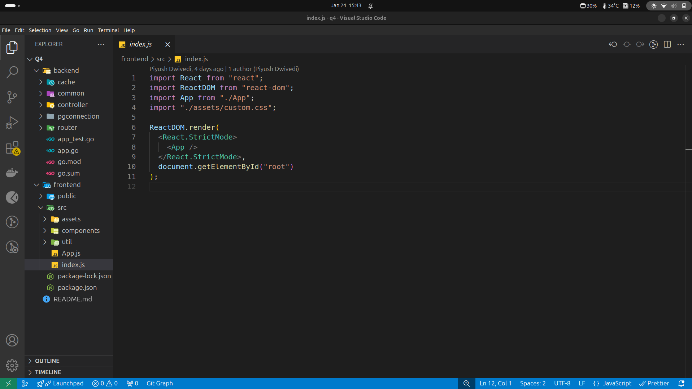
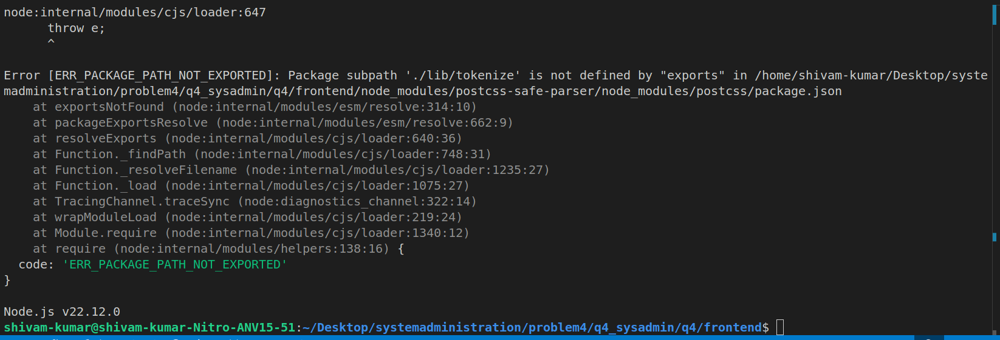
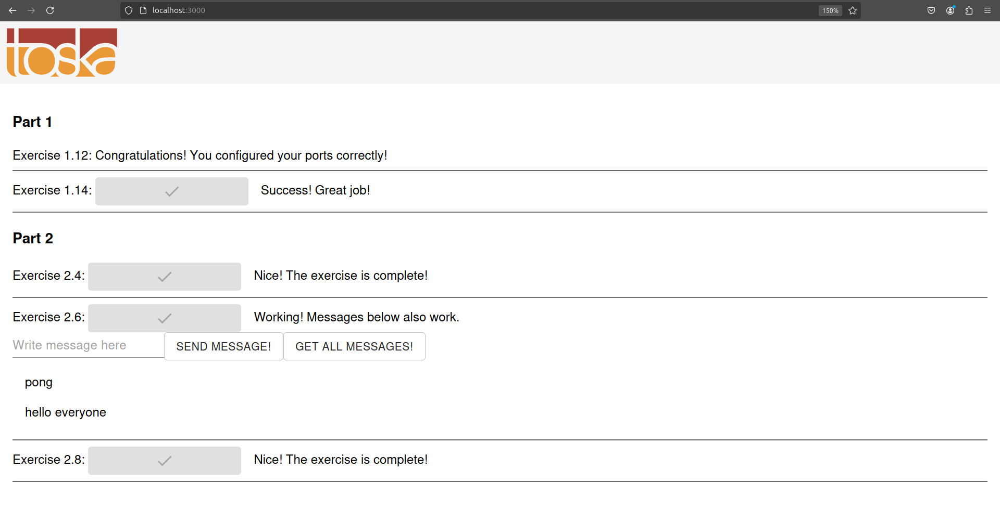
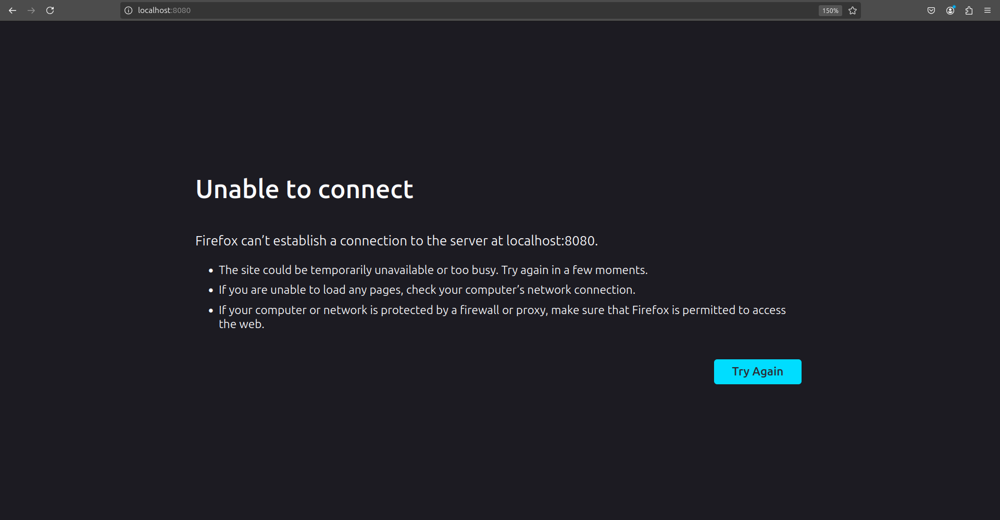

# Question 4 - Dockerizing a Full Stack App (Frontend + Backend)

## Cloning the Repository

First, I cloned the full stack application from GitHub using the following command:

```bash
git clone https://github.com/Rimurudemon/q4_sysadmin.git
```

After reviewing the source code, I discovered that the application uses **Golang** for the backend and **React** for the frontend.



## Backend Insights

Since I am familiar with React and Node.js but not with Golang, I searched online and learned the following:

* The ``` go.mod ``` file contains module dependencies, versions, and package details. Below is an excerpt from the ``` go.mod ``` file:

```go

module server

go 1.15

require (
	github.com/gin-contrib/cors v1.3.1
	github.com/gin-gonic/gin v1.6.3
	github.com/go-pg/pg/v10 v10.7.3
	github.com/go-redis/redis/v8 v8.4.2
)

```

* The backend uses:
	* **Golang** 1.15
	* **PostgreSQL** as the database
	* **Redis** for caching.

## Frontend Insights

The frontend uses **React 17**. Upon running the following commands:

```bash
npm install
npm start
```

I encountered the following error:



This error occurred because my current Node.js and npm versions were not compatible with **React 17**. After searching online, I found that **Node.js version 14** is compatible with **React 17**.

## Containerization of the Application

### Backend Dockerfile

I created a Dockerfile for the backend using **Golang 1.15** as mentioned in ```go.mod```. From the app.go file, I found that the application runs on **port 8080** by default, so I exposed **port 8080** in the Dockerfile.

Initially, I encountered the following error:

```bash
exec /backend: no such file or directory
```

After researching, I learned to use the following command to build a static Go binary:
```bash
RUN CGO_ENABLED=0 GOOS=linux go build -a -installsuffix cgo -o backend
```

Here is the final Dockerfile for the backend:

```dockerfile

FROM golang:1.15 AS build

WORKDIR /app

COPY go.mod go.sum ./

RUN go mod download

COPY . .

RUN CGO_ENABLED=0 GOOS=linux go build -a -installsuffix cgo -o backend

FROM alpine:latest

RUN apk add --no-cache ca-certificates

COPY --from=build /app/backend /backend


RUN chmod +x /backend

EXPOSE 8080

CMD ["/backend"]

```

### Frontend Dockerfile

For the frontend, I used **Node.js version 14** and **Nginx**. After running:
```bash
npm run build
```

I encountered the following error:

```bash
1.111 /app/node_modules/renderkid/node_modules/domutils/index.js:12 
1.111 DomUtils[key] = ext[key].bind(DomUtils);
```

This error was caused by a dependency conflict with the ```domutils``` package. To resolve this issue, I added a ```resolutions``` field in ```package.json``` to specify the version of ```domutils```:
```json
"resolutions": {
  "domutils": "^2.0.0"
}
```

Additionally, I found in ```./src/util/pingpong.js``` that the frontend must use **Nginx** to proxy backend requests made to the ```/api``` route:

```javascript
const baseURL = process.env.REACT_APP_BACKEND_URL || "/api";
```

The backend also has routes for saving and retrieving messages in ```router.go```:

```go
router.GET("/messages", controller.GetMessages)
router.POST("/messages", controller.CreateMessage)
```

I created a custom nginx.conf file to act as a proxy server that redirects requests made to /api to http://backend:8080:

### nginx.conf

```nginx
worker_processes 1;

events { worker_connections 1024; }

http {
    include /etc/nginx/mime.types;
    default_type application/octet-stream;

    sendfile on;
    keepalive_timeout 65;

    server {
        listen 80;

        location / {
            root /usr/share/nginx/html;
            index index.html index.htm;
            try_files $uri $uri/ /index.html;
        }

        location /api/ {
        proxy_pass http://backend:8080/;
        proxy_set_header Host $host;
        proxy_set_header X-Real-IP $remote_addr;
        proxy_set_header X-Forwarded-For $proxy_add_x_forwarded_for;
        proxy_set_header X-Forwarded-Proto $scheme;
        proxy_set_header Access-Control-Allow-Origin "*";
        proxy_set_header Access-Control-Allow-Methods "GET, POST, PUT, DELETE, OPTIONS";
        proxy_set_header Access-Control-Allow-Headers "Origin, X-Requested-With, Content-Type, Accept, Authorization";
    }

    }
}
```

### Docker Compose

The backend relies on **PostgreSQL** and **Redis**. From the ```./pgconnection/trypostgres.go``` file, I discovered the following required environment variables for the backend:

```go
postgresHost := os.Getenv("POSTGRES_HOST")
postgresUser := common.FallbackString(os.Getenv("POSTGRES_USER"), "postgres")
postgresPassword := common.FallbackString(os.Getenv("POSTGRES_PASSWORD"), "postgres")
postgresDatabase := common.FallbackString(os.Getenv("POSTGRES_DATABASE"), "postgres")

if len(postgresHost) == 0 {
	fmt.Println("[Ex 2.6+] POSTGRES_HOST env was not passed so postgres connection is not initialized")
	return
}
```

Additionally, ```router.go``` requires a ```REQUEST_ORIGIN``` environment variable to handle ```CORS```:

```go
allowedOrigin := common.FallbackString(os.Getenv("REQUEST_ORIGIN"), "https://example.com")

cache.InitializeRedisClient()
pgconnection.InitializePostgresClient()
```

### docker-compose.yml

```js

version: '3.8'

services:
  frontend:
    build: ./frontend
    ports:
      - "3000:80"
    networks:
      - applicationNetwork
    depends_on:
      - backend

  backend:
    build: ./backend
    
    networks:
      - applicationNetwork
    depends_on:
      - database
      - redis
    environment:
      - POSTGRES_HOST=database
      - POSTGRES_USER=postgres
      - POSTGRES_PASSWORD=postgres
      - POSTGRES_DB=postgres
      - REDIS_HOST=redis
      - REDIS_PORT=6379
      - REQUEST_ORIGIN=http://localhost:3000

  database:
    image: postgres:alpine
    volumes:
      - db-data:/var/lib/postgresql/data
    
    networks:
      - applicationNetwork
    environment:
      POSTGRES_USER: postgres
      POSTGRES_PASSWORD: postgres
      POSTGRES_DB: postgres

  redis:
    image: redis:alpine
    
    networks:
      - applicationNetwork

networks:
  applicationNetwork:
    driver: bridge

volumes:
  db-data:

```

## Networking Configuration
* A custom bridge network (```applicationNetwork```) was created to connect all services.

* The **frontend** (Nginx) listens on **port 80** in its container, mapped to **port 3000** on the host machine.

* The **backend** listens on port **8080** in its container but is not exposed to the host for added security.

* The frontend can access the backend through the shared network.

## Running the Application

To start the application, run the following command:

```bash
sudo docker compose up --build
```

## Demo and Verification

### Frontend and Backend Interaction

* The frontend works as expected and securely interacts with the backend.
* The backend is accessible only via the frontend.



### Backend Security

* The backend is not accessible from the host machine but is accessible to the frontend through the shared network, ensuring security.

