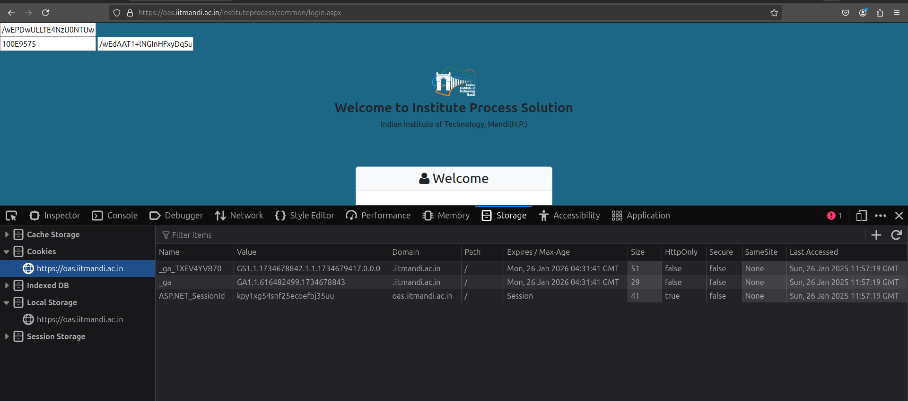

<!-- # Exception occurred: Message: element click intercepted: Element <select name="ctl00$ContentPlaceHolder1$TabContainer1$TabPanel1$ddlRoute" onchange="javascript:setTimeout('__doPostBack(\'ctl00$ContentPlaceHolder1$TabContainer1$TabPanel1$ddlRoute\',\'\')', 0)" id="ddlRoute" class="form-control" style="width:100%;">...</select> is not clickable at point (238, 411). Other element would receive the click: <div class="ajax__calendar_dayname">. -->

# Challenge 5 - Bus Booking Automation

**first i open the oas login page**

**then i found there are 6 input tag three of them are hidden 2 of them are LDAP username and password**


**then i checked for cookies it uses three cookie**

- ASP.NET_SessionId
- \_ga
- \_ga_TXEV4YVB70

After googling i find \_ga is for google analytics
and the ASP.NET_SessionId is mananged internally



**also in the busResevation link they are many input filed which we have to pass**


**Also in the request i found many parameter like**

`ctl00$ContentPlaceHolder1$TabContainer1$TabPanel1$txtFromDate`
`ctl00$ContentPlaceHolder1$TabContainer1$TabPanel1$M1_ClientState`
`ctl00$ContentPlaceHolder1$TabContainer1$TabPanel1$ddlRoute`
`ctl00$ContentPlaceHolder1$TabContainer1$TabPanel1$ddlTiming`
`ctl00$ContentPlaceHolder1$TabContainer1$TabPanel1$ddlBus`
`ctl00$ContentPlaceHolder1$TabContainer1$TabPanel3$MonthYear1$ddlMonth`
`ctl00$ContentPlaceHolder1$TabContainer1$TabPanel3$MonthYear1$ddlYea`


**out of all the params `__EVENTTARGET` is th parameter than we have to pass it can be any of the above**

**also after googling about the request paramters i found ASP.NET applications often rely on hidden fields like **VIEWSTATE and **EVENTVALIDATION for page validation**

SO i have to maintain the ASP.NET_SessionId through out the whole request so i searched and i found a moudule name `requests_html` and it contain a class `AsyncHTMLSession`

Also i used the python asyncio library so can i paused the execution of the code when it neccessary

**So i have to first login in the site before booking the bus**

```python
print("in try")
        busReservationUrl = "https://oas.iitmandi.ac.in/InstituteProcess/Facility/BusSeatReservation.aspx"
        loginURL = "https://oas.iitmandi.ac.in/instituteprocess/common/login.aspx"

        rollno = ""
        password = ""
        data = {}


        response = await session.get(loginURL)
        loginContent = response.html.html


        soup = BeautifulSoup(loginContent, 'lxml')
        input_tags = soup.find_all('input')

        for input_tag in input_tags:
            name = input_tag.get('name')
            value = input_tag.get('value')
            data[name] = value if value else ''


        data["txtLoginId"] = rollno
        data["txtPassword"] = password
        data["btnLogin"] = "Log In"

        for item in data.keys():
            print(item)


        loginPostRequest = await session.post(loginURL, data=data)
        print(loginPostRequest.status_code)
```

it return the status code 200 so i login succesfully

**now for selecting the route i inspect the page and i found then the bus Route is a option tag and has some values**


So i made my own dictionary

```python
 routeDictionary = [
        {"value": "1", "text": "North Campus -To- Mandi (via South)"},
        {"value": "2", "text": "Mandi -To- North Campus (via South)"},
        {"value": "7", "text": "North Campus -To- Mandi (Direct)"}
    ]

    routeGivenValue = "1"
    travelDate = "03/02/2025"
    timeToTravel = "06:00 PM"

    postDate = "ctl00$ContentPlaceHolder1$TabContainer1$TabPanel1$txtFromDate"
    postClientState = "ctl00$ContentPlaceHolder1$TabContainer1$TabPanel1$M1_ClientState"
    postRoute = "ctl00$ContentPlaceHolder1$TabContainer1$TabPanel1$ddlRoute"
    postTiming = "ctl00$ContentPlaceHolder1$TabContainer1$TabPanel1$ddlTiming"
    postBus = "ctl00$ContentPlaceHolder1$TabContainer1$TabPanel1$ddlBus"
    postMonth = "ctl00$ContentPlaceHolder1$TabContainer1$TabPanel3$MonthYear1$ddlMonth"
    postYear = "ctl00$ContentPlaceHolder1$TabContainer1$TabPanel3$MonthYear1$ddlYear"

```

**now its time for making a post request so that the busRoute is Selected**

```python
busReservationGet = await session.get(busReservationUrl, allow_redirects=True)
        busReservationGetHtml = busReservationGet.html.html

        with open('busReservationGetHtml.html', 'w') as r:
            r.write(busReservationGetHtml)

        firstData = {}
        soup = BeautifulSoup(busReservationGetHtml, 'lxml')
        input_tags = soup.find_all('input')

        for input_tag in input_tags:
            name = input_tag.get('name')
            value = input_tag.get('value')
            if name[0:5] != 'ctl00' and name != "__EVENTTARGET":
                firstData[name] = value if value else ''

        firstData['__EVENTTARGET'] = postRoute
        firstData[postDate] = travelDate
        firstData[postClientState] = ""
        firstData[postRoute] = routeGivenValue
        firstData[postMonth] = '01'
        firstData["__EVENTARGUMENT"] = ""
        firstData["__LASTFOCUS"] = ""
        firstData[postYear] = splitDate(travelDate)[2]

        settingRoutePostRequest = await session.post(busReservationUrl, data=firstData)
        print(settingRoutePostRequest.status_code)

```

here the `__EVENTTARGET` is the paramter we have to pass so here we are selecting the Bus Route so we have to pass `"ctl00$ContentPlaceHolder1$TabContainer1$TabPanel1$ddlRoute"` as \_\_EVENTARGET

Similary for Schedule we have to pass `"ctl00$ContentPlaceHolder1$TabContainer1$TabPanel1$ddlTiming"`

for Bus Route we have to pass
`"ctl00$ContentPlaceHolder1$TabContainer1$TabPanel1$ddlBus"`

**one thing also is that we also have to check the schedule of the bus that matches with the user Schedule**

so i then filter all the option of the select tag using beautifulSoup and select the option with the correct Schedule matching

```python
soup = BeautifulSoup(settingRoutePostRequestText, 'lxml')
        input_tags = soup.find_all('input')

        secondData = {}
        for input_tag in input_tags:
            name = input_tag.get('name')
            value = input_tag.get('value')
            if name[0:5] != 'ctl00' and name != "__EVENTTARGET":
                secondData[name] = value if value else ''

        select_bus_timing = soup.find('select', id='ddlTiming')
        options = select_bus_timing.find_all('option')
        optionsValue = ""
        optionsText = ""
        for option in options:
            value = option.get('value')
            text = option.text
            textSplit = text.split(" ")
            startingTime = textSplit[0]
            endingTime = textSplit[len(textSplit) - 1]
            timeToTravelSplit = timeToTravel.split(" ")
            timeToTravelfirst = timeToTravelSplit[0]
            timeToTravelsecond = timeToTravelSplit[len(timeToTravelSplit) - 1]
            if startingTime == timeToTravelfirst and endingTime == timeToTravelsecond:
                optionsValue = value
                optionsText = text
                break

        if optionsValue == "":
            raise Exception("Bus timing not found")
```

But after selecting the Bus No i found that the response give to me by the post request does not contain the table it might be dynamically generated


**so here i have two option**
* one is that i dynamically loads the content and then check which of the seat is vacant
* other one is i directly run a loop from 1 to 26 and check if any one of the post give give 200 status code
  

**so when i first go for option 2 i first manullay booked a bus and found**


**in the request paramter we have to pass the list of the checkbox which is on so i search on copilot and found that**


**when i make a post request it might only checked the checkbox which i include in the post request**

**i does not pass all the checkbox which is on because it is  dynamically generated by the javascript and i does not know about which checkbox is one**


**so when i go for the first option i have to run the javascript then fetch the response**

after searching i found how to run the js in background and write the function

```python
async def render_page(session, url, data):
    headers = {
    "User-Agent": "Mozilla/5.0 (Windows NT 10.0; Win64; x64) AppleWebKit/537.36 (KHTML, like Gecko) Chrome/91.0.4472.124 Safari/537.36",
    "Referer": busReservationUrl,
    "Content-Type": "application/x-www-form-urlencoded",
    }
    response = await session.post(url, data=data,headers=headers)
    await response.html.arender(wait=20)  
    
    print("Cookies:", session.cookies.get_dict())
    print("Final URL:", response.url)
    
    return response
```

**but when i make the post request it redirect me loginUrl this is the response but the status code is 200 but it still redirect to the loginUrl**

I searched a lot but not found any solution    
**i thinked that i should go for option2 but it might damage the busBookingSite so i did not do that **

```html

<body>
    <form name="form1" method="post" action="Login.aspx" id="form1">
<div>
<input type="hidden" name="__VIEWSTATE" id="__VIEWSTATE" value="/wEPDwULLTE4NzU0NTUwMDAPZBYCAgMPZBYCAgUPD2QWAh4Hb25jbGljawUTcmV0dXJuIHZhbGlkYXRpb24oKWRkzFUtj1UIfL4aNTSoGHh8RwnolGPPTf8YY66fd+ZEHNU=">
</div>

<div>

	<input type="hidden" name="__VIEWSTATEGENERATOR" id="__VIEWSTATEGENERATOR" value="100E9575">
	<input type="hidden" name="__EVENTVALIDATION" id="__EVENTVALIDATION" value="/wEdAAT1+lNGInHFxyDqSuQKBFFxePD35ryNm+41/1rVn7tp23Y2+Mc6SrnAqio3oCKbxYainihG6d/Xh3PZm3b5AoMQO6T/ZmdpbursY8AYrSSMHbyjSV8tF++ECp4n011aSJQ=">
</div>
        <section class="header text-center py-4">
            <div class="container">
                <a class="navbar-brand mb-3" href="#"></a>
                <h3 class="fw-bold">Welcome to Institute Process Solution</h3>
                <h6>Indian Institute of Technology, Mandi(H.P.)</h6>
            </div>
        </section>

        <section class="recruitment-section py-5">
            <div class="container">
                <div class="row justify-content-center">
                    <div class="col-md-4">
                        <div class="card h-100 shadow-sm">
                            <h3 class="card-header bg-light text-dark text-center">
                                <i class="fa fa-user"></i> Welcome
                            </h3>
                            <div class="card-body p-4">
                                <h4 class="text-center mb-5 fw-bold">LOG IN</h4>

                                <div class="form-floating mb-3">
                                    <input name="txtLoginId" type="text" id="txtLoginId" class="form-control" style="width:100%;">
                                    <label for="txtLoginId">LDAP-Username*</label>
                                </div>
                                <div class="form-floating mb-3">
                                    <input name="txtPassword" type="password" id="txtPassword" class="form-control" style="width:100%;">
                                    <label for="txtPassword">LDAP-Password*</label>
                                </div>
                                <div class="d-grid">
                                    <input type="submit" name="btnLogin" value="Log In" onclick="return validation();" id="btnLogin" class="btn btn-outline-primary">
                                </div>
                            </div>
                        </div>
                    </div>
                </div>
            </div>
        </section>

        <footer class="text-dark py-4">
            <div class="container">
                <div class="row">
                    <div class="col-sm-4">
                        <h5>Contact Us</h5>
                        <p>Email: <a href="mailto:oassupport@iitmandi.ac.in" class="text-primary">oassupport@iitmandi.ac.in</a></p>
                        <p>Phone: 01905-267199</p>
                    </div>
                    <div class="col-sm-4">
                        <h5>Technical Issues</h5>
                        <p>Developer: Rahul Thakur</p>
                        <p>Email: <a href="mailto:oasoffice3@iitmandi.ac.in" class="text-primary">oassupport@iitmandi.ac.in</a></p>
                        <p>Phone: 01905-267199 / 9501893704</p>
                    </div>
                    <div class="col-sm-4">
                        <a href="#"></a>
                    </div>
                </div>
            </div>
        </footer>
    </form>

```

## PYTHON CODE
#### first fill the rollno and password paramter then run the code

```python
from requests_html import AsyncHTMLSession
from bs4 import BeautifulSoup
import asyncio

busReservationUrl = "https://oas.iitmandi.ac.in/InstituteProcess/Facility/BusSeatReservation.aspx"


def splitDate(s):
    a = s.split('/')
    return [a[0], a[1], a[2]]

async def render_page(session, url, data):
    headers = {
    "User-Agent": "Mozilla/5.0 (Windows NT 10.0; Win64; x64) AppleWebKit/537.36 (KHTML, like Gecko) Chrome/91.0.4472.124 Safari/537.36",
    "Referer": busReservationUrl,
    "Content-Type": "application/x-www-form-urlencoded",
    }
    response = await session.post(url, data=data,headers=headers)
    await response.html.arender(wait=20)  
    
    print("Cookies:", session.cookies.get_dict())
    print("Final URL:", response.url)
    
    return response

async def main():
    session = AsyncHTMLSession()
    
    routeDictionary = [
        {"value": "1", "text": "North Campus -To- Mandi (via South)"},
        {"value": "2", "text": "Mandi -To- North Campus (via South)"},
        {"value": "7", "text": "North Campus -To- Mandi (Direct)"}
    ]
    
    routeGivenValue = "1"
    travelDate = "03/02/2025"
    timeToTravel = "06:00 PM"

    postDate = "ctl00$ContentPlaceHolder1$TabContainer1$TabPanel1$txtFromDate"
    postClientState = "ctl00$ContentPlaceHolder1$TabContainer1$TabPanel1$M1_ClientState"
    postRoute = "ctl00$ContentPlaceHolder1$TabContainer1$TabPanel1$ddlRoute"
    postTiming = "ctl00$ContentPlaceHolder1$TabContainer1$TabPanel1$ddlTiming"
    postBus = "ctl00$ContentPlaceHolder1$TabContainer1$TabPanel1$ddlBus"
    postMonth = "ctl00$ContentPlaceHolder1$TabContainer1$TabPanel3$MonthYear1$ddlMonth"
    postYear = "ctl00$ContentPlaceHolder1$TabContainer1$TabPanel3$MonthYear1$ddlYear"

    try:
        print("in try")
        
        loginURL = "https://oas.iitmandi.ac.in/instituteprocess/common/login.aspx"

        rollno = ""
        password = ""
        data = {}

     
        response = await session.get(loginURL)
        loginContent = response.html.html

        # Parse the login page HTML to get hidden input values
        soup = BeautifulSoup(loginContent, 'lxml')
        input_tags = soup.find_all('input')

        for input_tag in input_tags:
            name = input_tag.get('name')
            value = input_tag.get('value')
            data[name] = value if value else ''

      
        data["txtLoginId"] = rollno
        data["txtPassword"] = password
        data["btnLogin"] = "Log In"

        for item in data.keys():
            print(item)

        # Perform the login POST request
        loginPostRequest = await session.post(loginURL, data=data)
        print("login status code ",loginPostRequest.status_code)

       
        if loginPostRequest.status_code == 200 and 'ASP.NET_SessionId' in session.cookies:
            print('Login successful')
        else:
            print('Login failed')
            raise Exception("Login failed")

       
        busReservationGet = await session.get(busReservationUrl, allow_redirects=True)
        busReservationGetHtml = busReservationGet.html.html

      
       
       
        firstData = {}
        soup = BeautifulSoup(busReservationGetHtml, 'lxml')
        input_tags = soup.find_all('input')

        for input_tag in input_tags:
            name = input_tag.get('name')
            value = input_tag.get('value')
            if name[0:5] != 'ctl00' and name != "__EVENTTARGET":
                firstData[name] = value if value else ''

        firstData['__EVENTTARGET'] = postRoute
        firstData[postDate] = travelDate
        firstData[postClientState] = ""
        firstData[postRoute] = routeGivenValue
        firstData[postMonth] = '01'
        firstData["__EVENTARGUMENT"] = ""
        firstData["__LASTFOCUS"] = ""
        firstData[postYear] = splitDate(travelDate)[2]

        settingRoutePostRequest = await session.post(busReservationUrl, data=firstData)
        print("bus route slection status code ",settingRoutePostRequest.status_code)
        settingRoutePostRequestText = settingRoutePostRequest.html.html
      

        # Checking schedule 
        soup = BeautifulSoup(settingRoutePostRequestText, 'lxml')
        input_tags = soup.find_all('input')

        secondData = {}
        for input_tag in input_tags:
            name = input_tag.get('name')
            value = input_tag.get('value')
            if name[0:5] != 'ctl00' and name != "__EVENTTARGET":
                secondData[name] = value if value else ''

        select_bus_timing = soup.find('select', id='ddlTiming')
        options = select_bus_timing.find_all('option')
        optionsValue = ""
        optionsText = ""
        for option in options:
            value = option.get('value')
            text = option.text
            textSplit = text.split(" ")
            startingTime = textSplit[0]
            endingTime = textSplit[len(textSplit) - 1]
            timeToTravelSplit = timeToTravel.split(" ")
            timeToTravelfirst = timeToTravelSplit[0]
            timeToTravelsecond = timeToTravelSplit[len(timeToTravelSplit) - 1]
            if startingTime == timeToTravelfirst and endingTime == timeToTravelsecond:
                optionsValue = value
                optionsText = text
                break

        if optionsValue == "":
            raise Exception("Bus timing not found")

        globalPostTiming = optionsValue
        secondData["__EVENTTARGET"] = postTiming
        secondData[postClientState] = ""
        secondData[postRoute] = routeGivenValue
        secondData[postTiming] = optionsValue
        secondData[postMonth] = "01"
        secondData[postYear] = splitDate(travelDate)[2]
        secondData["__EVENTARGUMENT"] = ""
        secondData["__LASTFOCUS"] = ""

        scheduleBookResponse = await session.post(busReservationUrl, data=secondData)
        print("bus schedule response status code",scheduleBookResponse.status_code)
        scheduleBookResponseText = scheduleBookResponse.html.html

       
        ####### BUS SELECTION

        thirdData = {}
        

    
        soup = BeautifulSoup(scheduleBookResponseText, 'lxml')
        input_tags = soup.find_all('input')
        for input_tag in input_tags:
            name = input_tag.get('name')
            value = input_tag.get('value')
            if name[0:5] != 'ctl00' and name != "__EVENTTARGET":
                thirdData[name] = value if value else ''

        select_bus_name = soup.find('select', id='ddlBus')
        options = select_bus_name.find_all('option')
        if len(options) == 0:
            raise Exception("No buses found for this particular timing")
        optionsBusValue = ""

        for option in options:
            value = option.get('value')
            optionsBusValue = value
            break
        thirdData["__EVENTTARGET"] = postBus
        thirdData[postClientState] = ""
        thirdData[postRoute] = routeGivenValue
        thirdData[postTiming] = globalPostTiming
        thirdData[postBus] = optionsBusValue
        thirdData[postMonth] = "01"
        thirdData[postYear] = splitDate(travelDate)[2]
        thirdData["__EVENTARGUMENT"] = ""
        thirdData["__LASTFOCUS"] = ""

        
        session.cookies.update(loginPostRequest.cookies)

        busSelectionResponse = await render_page(session,busReservationUrl,thirdData)
        print("Redirect headers:", busSelectionResponse.headers)

        busSelectionResponseText = busSelectionResponse.html.html
        print("bus no response status code ",busSelectionResponse.status_code)
        
      
       
    except Exception as e:    
        print(e)
    finally:
        await session.close()
asyncio.run(main())        

```

### VIDEO LINK

# Video Example

<video width="640" height="480" controls>
  <source src="./Screencast from 2025-01-28 20-16-55.webm" type="video/webm">
  Your browser does not support the video tag.
</video>
