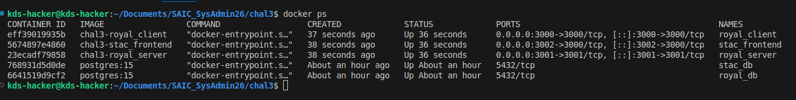
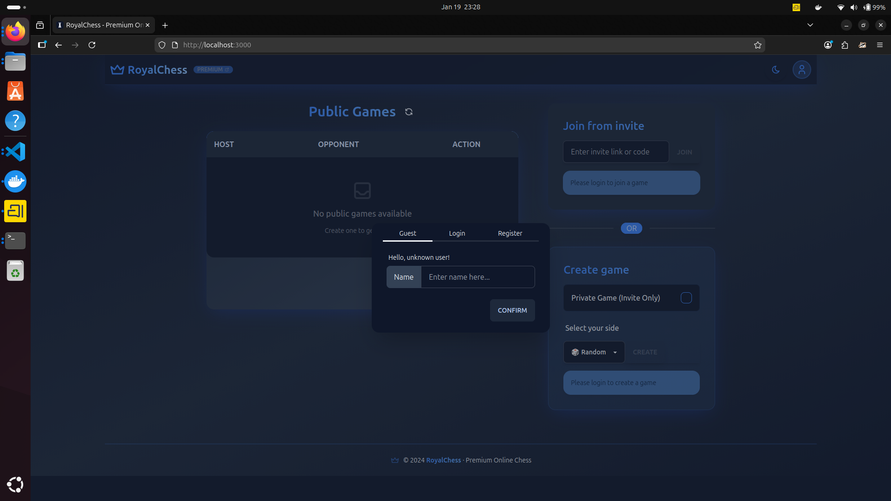

## Prerequisites:
- Docker Desktop
- PostgreSQL

## Explanation
1. The STAC backend has various useless and some conflicting requirements that I fixed and the final requirements file is along with the dockerfile in the STAC/backend folder. Similarly stac frontend has 1 package version conflict which is resolved and package.json is kept in the STAC/Frontend.

2. The dockerfile for the client and server of RoyalChess are in the respective directories

3. Clone both the repos in the respective folders and edit the ENV if you changed the path of any of them, or if you want to change any of the ports.

4. After the setup is done just run `docker compose up --build -d` (run this where you have kept the docker-compose.yml). Then wait for the build process to complete

5. You can check after the build is complete that the websites will be at the following links: (If you kept every port as default)
    - localhost:3000 (RoyalChess Frontend)
    - localhost:3002 (STAC Frontend)

## Screenshots

#### `docker ps` command output

#### `Royal Chess` Website

#### `STAC` Website
