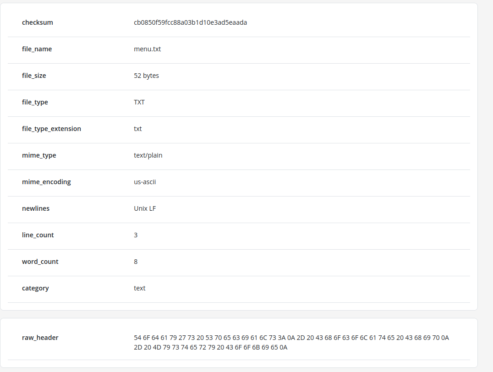
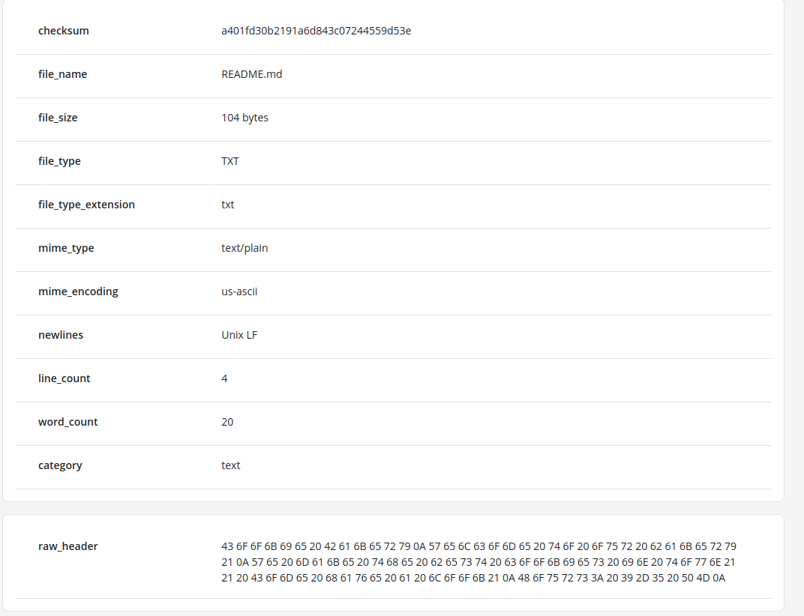
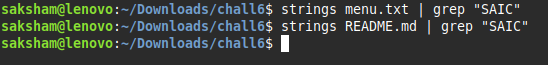
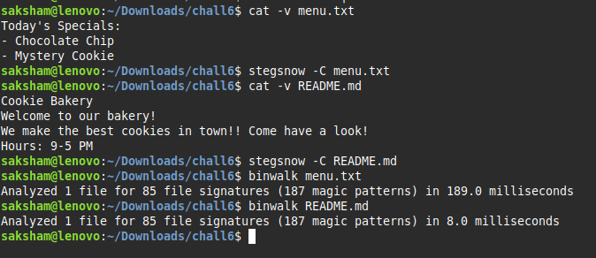
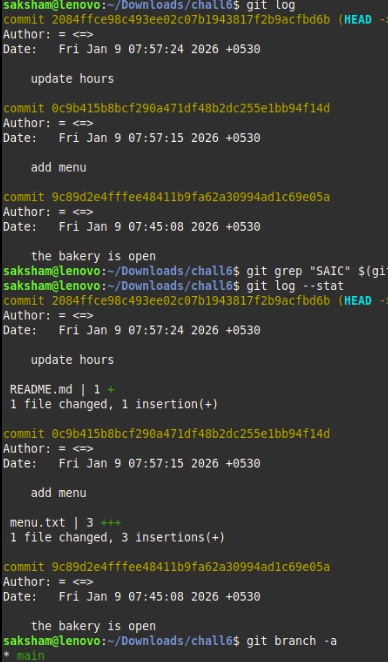
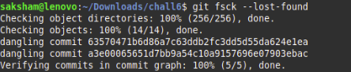
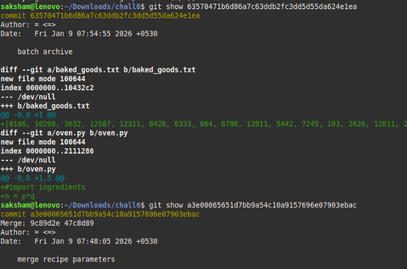
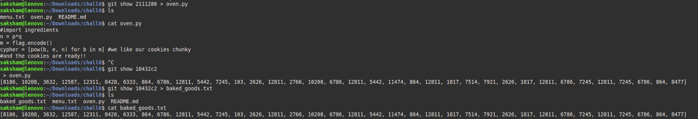
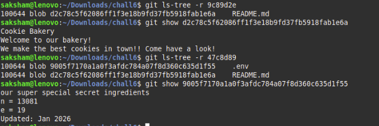
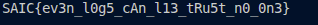

Challenge 4 -- The Bakery's Secret Recipe

I have a folder which contains two file menu.txt and README.md

So first I checked metadata of both files and there are no any type of
suspicious in it.

Metadata -

{width="5.6465in"
height="4.261in"}

{width="5.222in"
height="4.0043in"}

Now I tried to find strings containing flag but failed

{width="5.7083in"
height="0.6772in"}

I also did more operations but not got anything

{width="6.6929in"
height="2.8992in"}

Then I remember it is a git repo so I started to check git

{width="3.1965in"
height="5.4535in"}

I reset to each commit but there were not found flag

Then I run command for recover deleted commits Dangling commits

Then I found dangling commits

{width="4.6252in"
height="0.948in"}

In these commits-

{width="6.6929in"
height="4.4181in"}

Two files found- baked_goods.txt and oven.py

get these files and open them

{width="6.6929in"
height="1.1492in"}

In oven.py there is code of RSA encryption whose cyphertext is in
baked_goods.txt

But ingredients missing that is n,e,p,q. Confirm that there is
ingredient file is hidden

In second hash obtained from dangling commits In this commit two commits
are merged .

On checking these commits

{width="6.6457in"
height="2.2189in"}

Ingredients found that is n,e from which p,q both primes can be found

p = 127, q = 103

On decoding cyphertext in rsa decoding script I found flag.

That is
{width="3.3126in"
height="0.2602in"}
