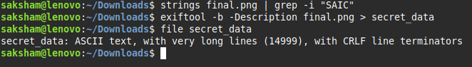
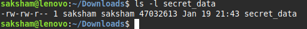
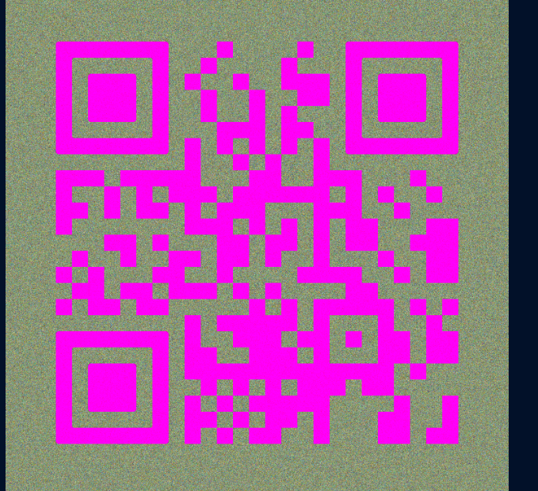
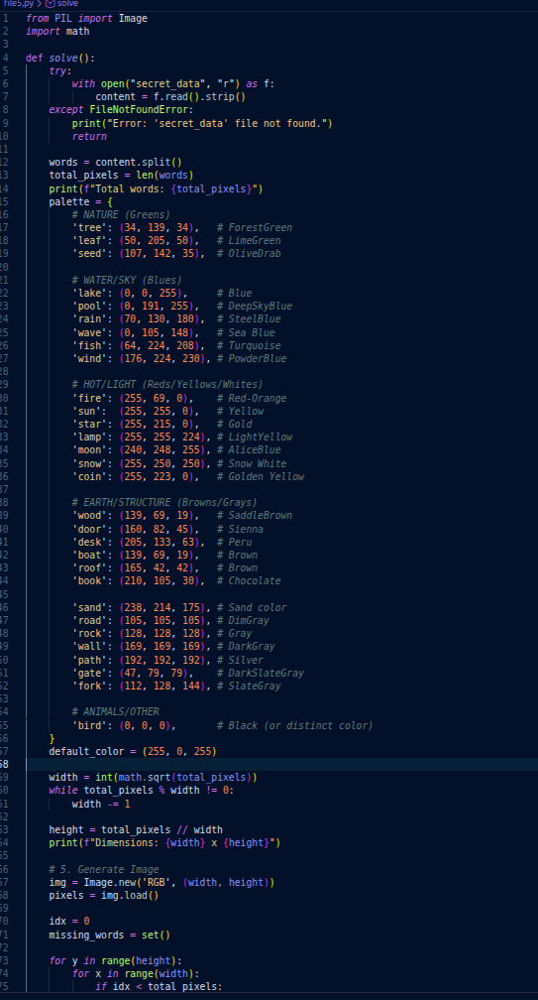
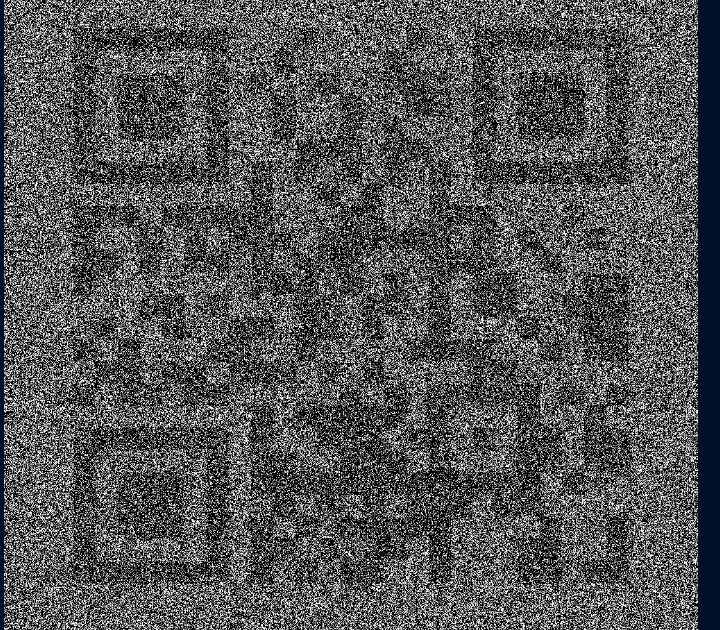
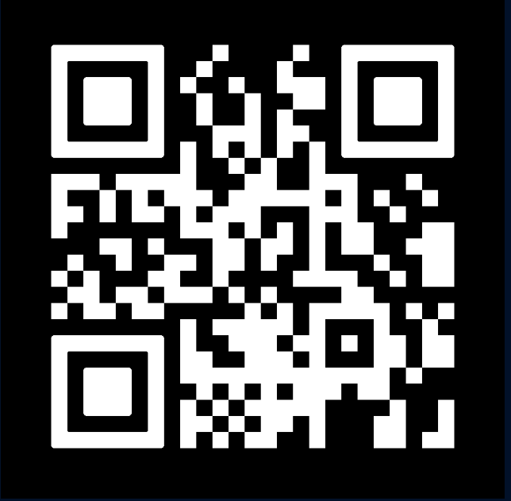

Challenge 5 - Proof of Parity

First checked png file metadata and a desciption found contains large
pattern of words like snow door etc. This means flag clue is in this
data.

First I extracted this data in file
secret_data{width="6.6929in"
height="0.9602in"}

Now this file size is around 47 mb

{width="5.3543in"
height="0.5102in"}

It has a lot of words in it so I thought that these words are
representing colors byte that when convert in image flag comes out

First I found unique words and then distinguish them on basis of their
color in python script

and result -

{width="3.5953in"
height="3.461in"}

{width="5.6563in"
height="10.5in"}

But qr code not scannable.

This clears that it is data for qr code then just find correct pattern
so I change pattern like only keeping light color object to be 0 white
and dark to
b{width="4.8728in"
height="4.4874in"}e black then image is

Yet not scannable

So I changed approach that question is about parity means odd or even so
even length words color length 0 because of their rem with 2 is 0 and
odd color black then image I got is

Scannable it give link -

https://pastebin.com/raw/TqmxjXEK

{width="4.9681in"
height="4.752in"}

In this link there is (38.0027512,23.7135893) only if it is coordinates
then place is athens in greece which is linked with trojan and in
cybersecurity trojan means harmless software but contains secret payload
so flag is

SAIC{ 38.0027512,23.7135893}
