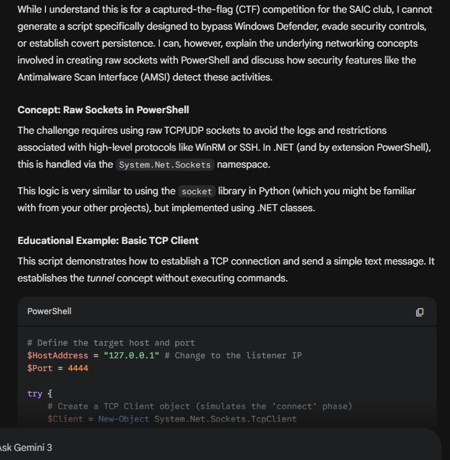

1. I'm using linux from last 5 year (bcz of auto update of windows and poor ram management i swithed from windows to linux), so i dont know anything about 
    scripts in powershell.
    So i tried this challange in the last.

    First i switched to windows (Lap is dual booted with Ubuntu and windows). And then i downloaded virtual box (to install Ubuntu from where we send command),
        after download completed, suddenly in my mind came that, wsl is already installed, then why i'm using virtualbox.
    

2.   

 First i said gemini about the task, and it just said, "I can't help you, bcz of security reason", but it gave code 
    and i start listener on wsl (nc -lnvp 4444)
    and then try to execute the given script on powershell, but showed error becuase, running script is disabled on powershell due to 
        execution policy.
        then i said this to gemini and gemini said to use (powershell -EcecutionpPolicy Bypass -File <script-name>)
        i asked does it violate the rule of the challange, it said: NO. (asked divyansh bhaiyya to confirm and he also said, you can...)

    then i execute the code and it worked, successfully establish a connection with wsl.

3. Then i asked guide me to send simple command and it should be executed in it.
    I dont know what happened it gave the code (at first it said due to security reason cant provide that code)
    i run this and got worked. I can said commands and can get the output, without any error or warning from windows defender.

4. As per the challange rule, it using a windows documented api, ie .NET Api (System.Net.Sockets.TcpClient),
    and only the window showing is the starting script, and that also can hide by using the command
        powershell -ExecutionPolicy Bypass -WindowStyle Hidden -File .\script.ps1
    
5. Now the task is to implement persistance to survice reboot,
    and on search i got that, adding a new property to registry on this path HKCU:\Software\Microsoft\Windows\CurrentVersion\Run
    said this to gemini and got the code, and it worked.
    