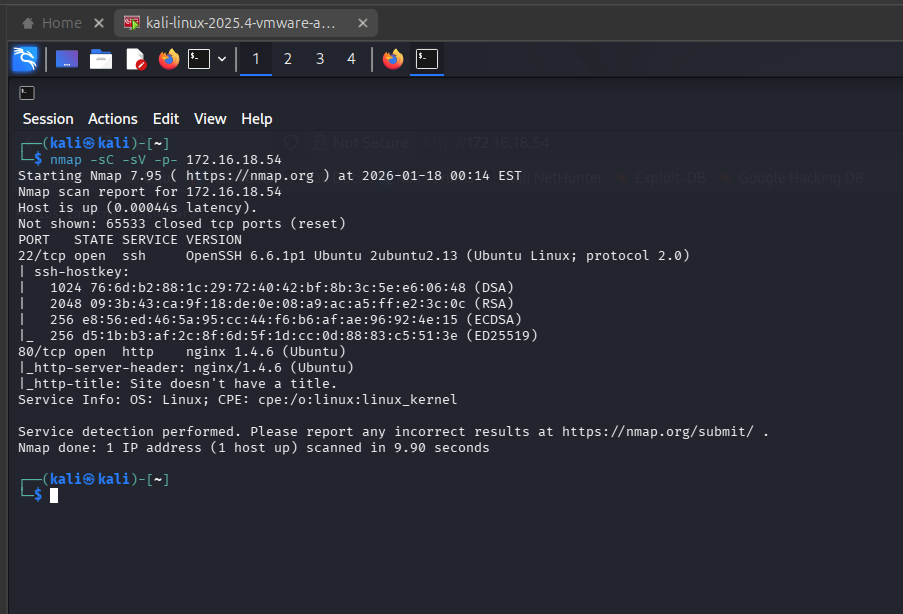
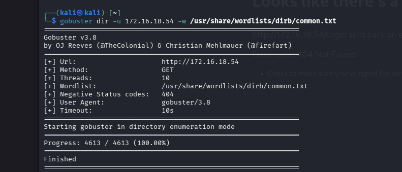
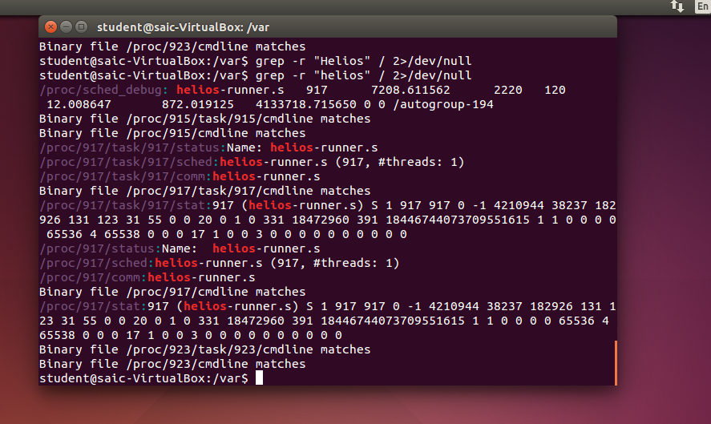
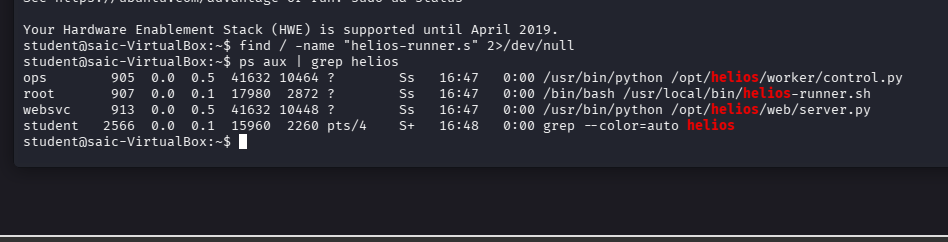
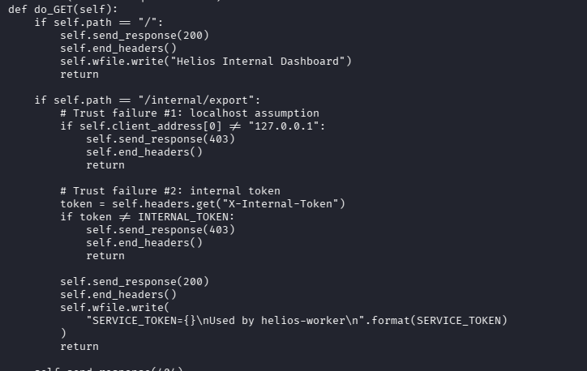
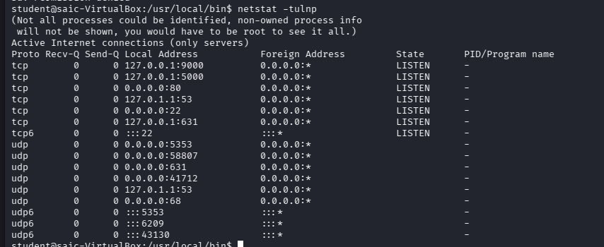

1. Here i first downloaded the virtual machine, and opened it in virtual box
    Since my kali linux is in VMware and saic.ova is in virtual box (Saic.ova crashes in vmware), so for communication between this, i changed the network adapter of saic to briged (defualt was NAT)
    
2. Then i logged in saic using the given credintials, and when i went to local host, it was a simple webpage with a text.. 
    There is no login page or nothing like that, so i understand, i want to scan the IP addr of saic using nmap
    
    for finding ip addr,  i tried to open terminal using shortcut(ctrl+alt+T) but didnt worked,
    then tried to right click and "open in terminal" but it also was not there.
    
    Then in application menu i got it, and from there..
    In terminal, i used ifconfig and got the ip addr:172.16.18.54. i tried to access the website from kali using this ip and it worked.
    Hence i'm ready to go with nmap.
    

3. I run a full scan including all ports, and common service vulerability checks (nmap -sC -sV -p- 172.16.18.54)
    Here i got two service, one http(ofcourse for webpage) and one is ssh  
    
     
     

4. I first go for http since in challange discription, they said server hosting a website. so probability is greater for this.

5. since the home page contains nothing, i want to go the any other page, i tried /admin, /login but no use, it just 404 !..

6. So i used gobuster and scanned using /usr/share/wordlists/dirb/common.txt
    There is no use of this.. didnt get anything..
    After this i was blank...   
    

7. Then i thought about finding the www folder.. normally( for apache server ) it will be in /var/www.
    But there is no such folder, then i again check the output of nmap, so the server is actually nginx.
    So to get the folder location i used the command "whereis nginx" and i got three folder, /etc/nginx /usr/share/nginx
    
    i look in to each folder one by one...
    
    but didnt get the page i saw in browser, so they are hostel this in some other location.
    so i googled, how to find the specific location, of running nginx server.
    
    I tried the methods, but didnt get the location of that page, so i switched from google to gemini...
    
8. i explained the details to it..

9. Gemini first said to search the text in Webpage (Helios .....), in all folder using grep
    grep -r "Helios" / 2>/dev/null ----------- /dev/null is used to avoid permission error
    this gives nothing, but when i changed the capital H to small, it gaves some result. So i think may be that file will be in some where, my student user dont have access..
    That's why it didnt give any result for capital H.  
    
      
10. But the small h, result gave the proccess id (since /proc contains the memmort info). 
    So i searched in google that, can get the execution location from PID, then i got the command for that.. (ls -l /proc/917/exe)
    but it showed i dont have permission to run this....
    Then gemini gave another code to find the file "find / -name "helios-runner.s" 2>/dev/null"
    it gave a blank output, then i use, ps aux command, grep the helios from that, and i got it..
    mainly two script is focusing, server.py and runner.sh  
    

    
    
11. Now i will cat the these two files can check the codes inside it.
    For helios-runner.sh,, cat showed permission denied
    and for server.py it worked, and this the actual file i was looking for.  
    
    
    
    in the code i found a great thing, that the actual server is this python, which is running on port 5000, but it not exposed to outside.
    and the when we request to the ip on port 80, the nginx server works here, and it just forward the request to python server on port 5000.
    
    so our target is not port 80, it is the port 5000... and it can only accessed from inside the saic vm. and actually i went to localhost:5000 and i got the same webpage.
    
12. And in that server.py, i saw another url /internal/export, and inside the code i saw that they ask for internal token and it said the service token
    these two token are stored in /etc/helios/web.env (internal) and /etc/helios/worker.env(Service_token)
    and the internal token can simply accessed using cat, and i got it 9877981220e470cf3cfc49e73d98ba5a
    now i'm thinking to said a curl request to url and get the service token (may be this will be the flag)
    
13. I did the curl "curl -H "X-Internal-Token: 9877981220e470cf3cfc49e73d98ba5a" http://127.0.0.1:5000/internal/export"

    and the output was just SERVICE_TOKEN=313b96f83a85fb32b31ec70d86d5e40c , Used by helios-worker
    
14. Used by helios worker. May be this will be key for something..

15. there is another python file called control.py, which can be accedd using cat.
    I'm thinking, may be this also listening on some port, which is not exposed to outside
    only accessed from saic vm, and there we want to put this token
    so i want to scan for the port.
    so i run netstat -tulnp
    and the output showed aorund 6  port listening service including the port 5000 and 80 
    I saw port 9000 here and i think may be this will be worker.py, so i will just open this port in browser
    (the other ports are dns(53), cups(631))
      
    
    
16. It showed it will not accept get request

17. then i open port 631 in browser, then i got a printing servie called cups, so i took a screen shot
    and said to gemini, and ask is there any vulnerabilty for this thing and i got to know that  its just normal printer service in ubuntu, no need to worry..
    
18. Then i said POST request to 9000 using the code given by gemini, 
    at first i forget to put the Token at that time, error was 403,
    then i put the token error was 400..

    So it means, it works, and i ask gemini about error 400, and got to know that data format is not good.

    then i tried python script which automates the post request also cares about the format.

    usually python server accepts json so i said in that format but didnt worked.

    I was clue less here, since random guessing of this data format will not work.

    So i leave this here and comes if i have time.
    
    
    
