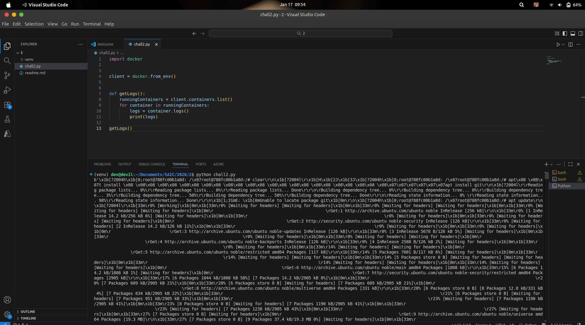
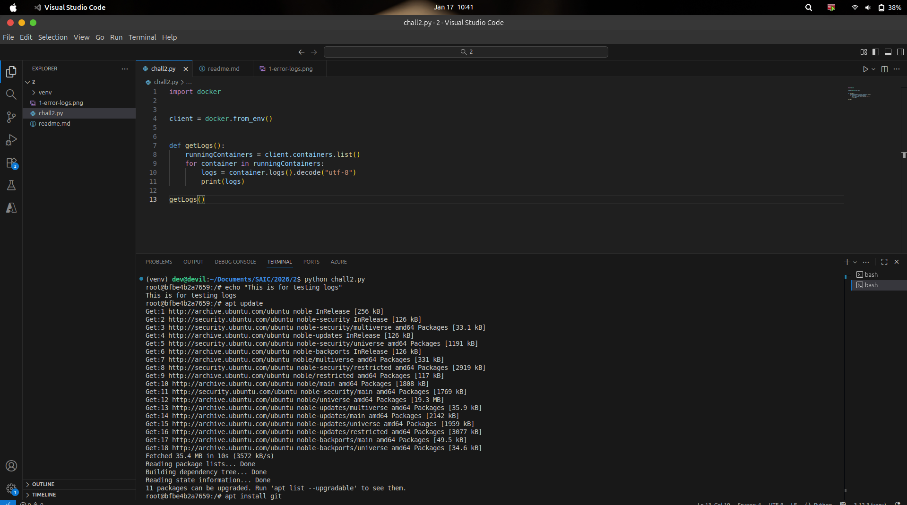
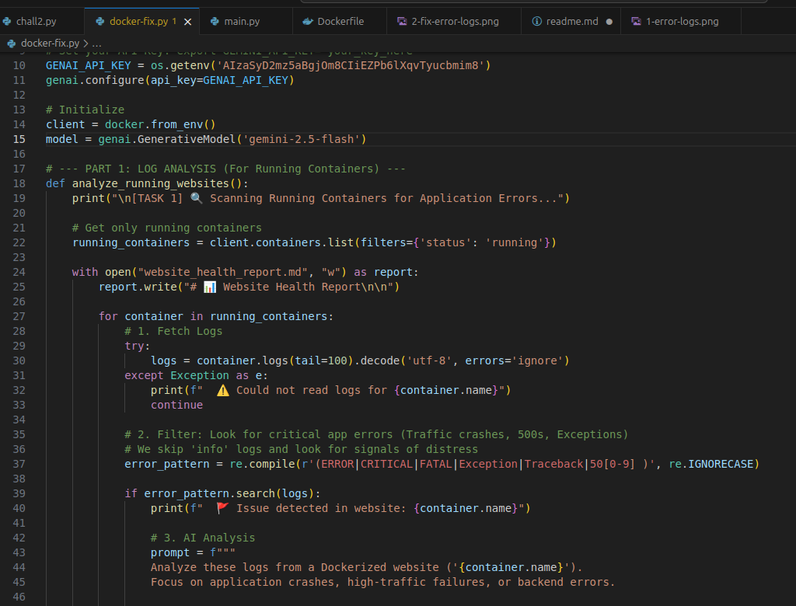
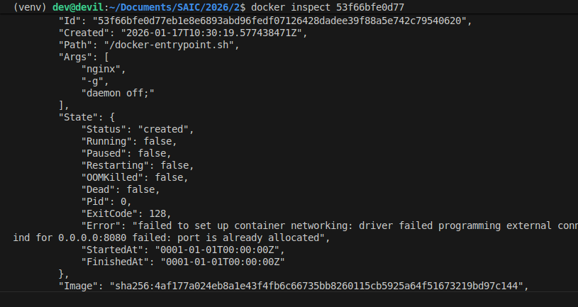
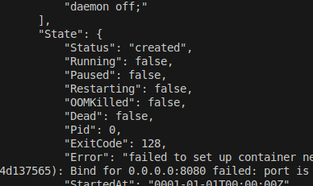
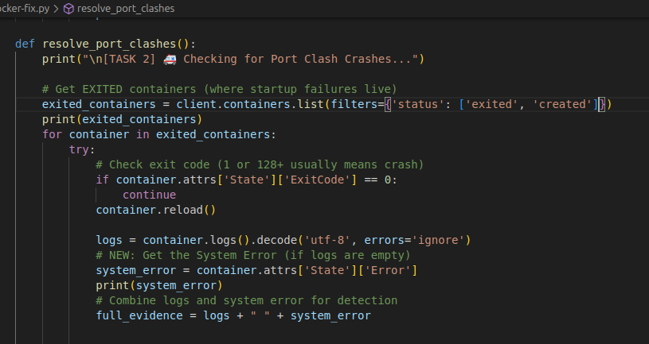

1. My plan is to use python and docker module in python to handle the logs
    in docker container (Since i tried this for 2023 sysadmin test) (Also studied about docker, docker networking, docker-compose during sem break)

    and for understanding what error caused and what will be the solution for that error, 
    i'm planning to use AgentAI (i have took the google's 5days AI agent intensive, 
    since it was in the time of sem exam, i didn't studied at that time, but during sem break i watched youtube video and studied it-
    not become a pro :( , but gemini is here to help so proceeding with this plan.
    

2. so first created a venv (python3 -m venv venv)

3. then installed the docker module (pip install docker)

4. then started to create the first function getLogs() 

5. i just run a ubuntu container in the background and just test this getLogs function, it printed a huge random text, at that time i realized that i forget to convert the logs
    to standard utf-8.   

      
    

6. After doing that, it printed correctly. (output shown is becuase i run apt update inside container to get some logs)
      
      

7. Now i'm planning to set the ai agent, and bypass this logs to that ai agent

8. There will be one agent which focus on filtering errors and critical issues seen in logs and this will be passed to another agent who will analyze the error,
    give the report. (From YT i understand making diffrent agent for specific task is better than making one agent for all task, to reduce error and increase accuracy)

9. I have doubt about the limit of api key(google AI studio) in free tier, but i got to know that we can send 5 Req per minute and enough tokens per minute also 100 request per
    day (Gemini-2.5-pro) which enough for this

9. i ask gemini to give the code by explaining this 

10. The code which gemini gave is not a agentic AI but a simple genAI(google.generativeai), may be becuase of my prompt, but then i thought to use this first and if 
    doesnt work then ask for the agentAI.  
      

11. now i want to simulate the errors and check how the analyzys and final report comes. For this i thought to run a python container in detach mode which continuosly
    printconnection timeout to database  
    (docker run -d --name pythonErrorTest python:3.9-slim python -c "import time; print('CRITICAL: database connection timeout at 192.168.1.5'); time.sleep(5000)")

    On checking the log i cant see any ouput so i ask gemini what the problem here, so it said, python holds the text in memmory and not print it to logs, it wait for 
    large text and then print everything at once, to avoid this put -u in command so i run the new command

    docker run -d --name pythonErrorTest python:3.9-slim python -u -c "import time; print('CRITICAL: Database connection timeout at 192.168.1.5'); time.sleep(1000)"
    now its showing....

12. Now with full exitment i'm running the script, hoping it will analyze everything fine.

13. And it is working fine and attached the video in "Working Videos/Making Report.mp4"

14. Now testing the port clash, for this i will start a ngnix server at 8080 port on host and then start another ngnix on the same port
    (docker run -d -p 8080:80 --name ngnix1 nginx)
    (docker run -d -p 8080:80 --name ngnix2 nginx)

15. When i tried this, and first check the logs of ngnix2, but it empty because the container is not even started, to be port clash.
    So i just did docker inspect and here under State there is Error:  
       
    So in python, i want to add this.
    After doing that i just run the script

    Then also didnt worked, i took too much time to analyze that the actuall problem occured is in the filter command that i filtered only "status:exited" containers,
    but when i inspect ngnix-2 its status is "created" (when i googled i got to know that, since the container clashed before it starts to run, so the status was stuck on to created)  
      
    so i changed the filter to include this "created" status and run the script
      
    

16. And it worked! I have included the video working videos.

17. during deletion of unnecessary files, i deleted the website_health_report, which i shown in video,
    then i again start the script, actually at this time i was doing the chall3, and hence i got the report and solution of problems in that challange...
    