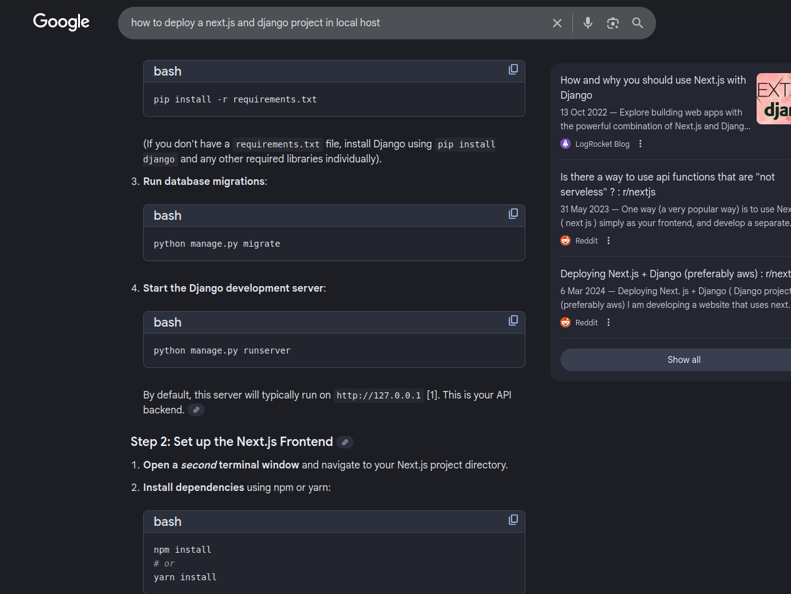
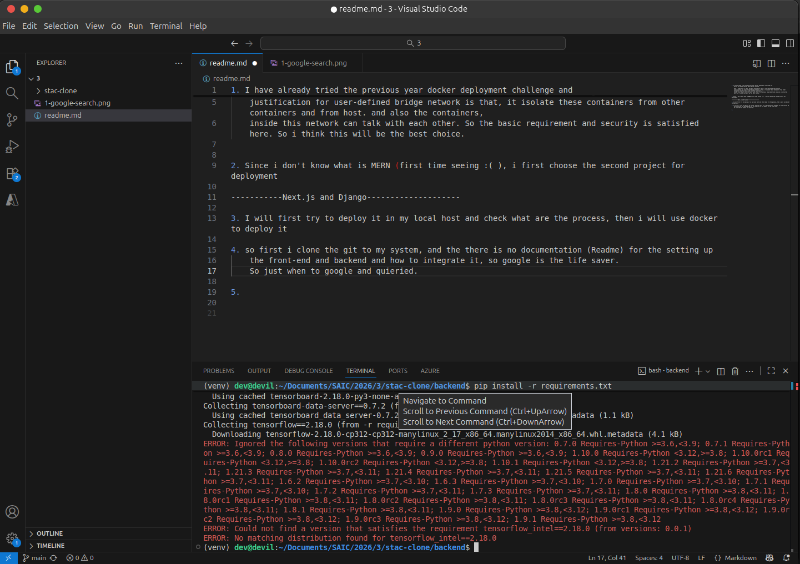
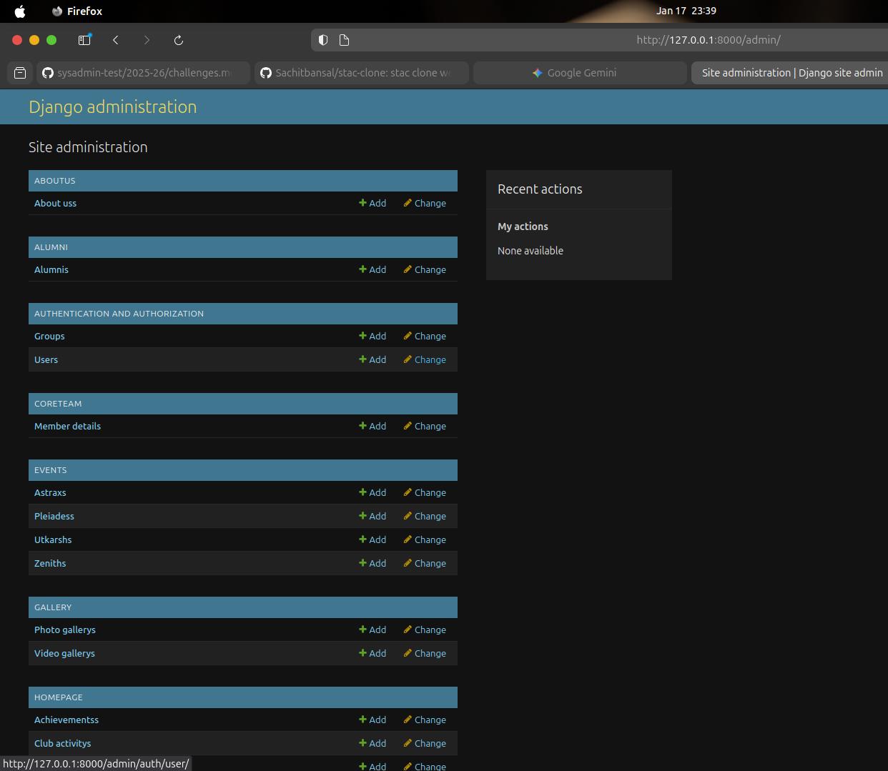
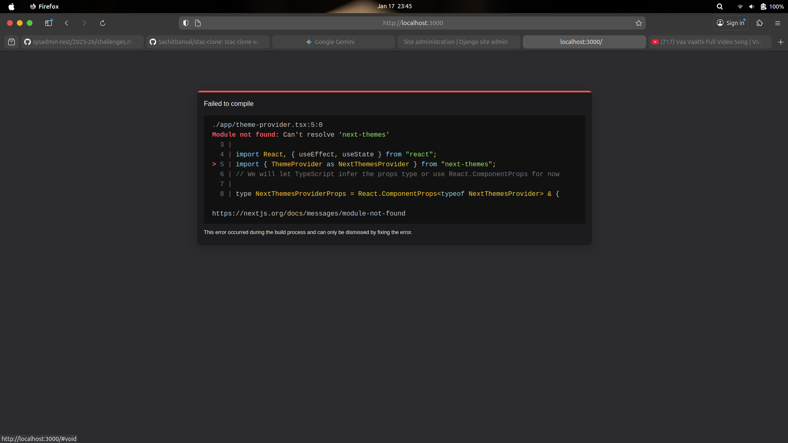
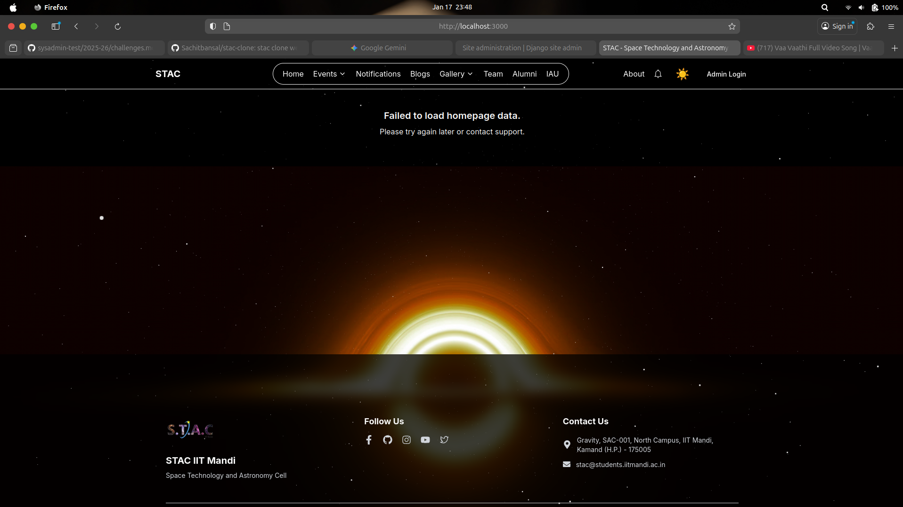

1. I have already tried the previous year docker deployment challenge and 
    during sem break learned about docker network.
    
    what i understand is that, the best network for this is user-defined bridge network.
    justification for user-defined bridge network is that, it isolate these containers from other containers and from host. and also the containers,
    inside this network can talk with each other. So the basic requirement and security is satisfied here. So i think this will be the best choice.
    

3. I will first try to deploy it in my local host and check what are the process, then i will use docker to deploy it

4. so first i clone the git to my system, and the there is no documentation (Readme) for the setting up
    the front-end and backend and how to integrate it, so google is the life saver.
    So just when to google and quieried.  
      

5. during pip install requirement i got a error about tensorflow_intel version not matching.
    Then on searching i got to know that, tensorflow_intel is windows-only package, and since i'm using 
    Ubuntu i dont require that, so removing the module from requirement will fix the issue.
      
    

      

    And that issue fixed, but similar issue came : ERROR: No matching distribution found for torch==2.6.0+cpu...
    again google search.... This issue is also due to i'm using Linux not windows. again fixed the issue by adding an extra link to rquirement.txt

    Now that solved another error occured (What the **** is this)... this error is due to the version compatabilty issue and I downgrade numpy to 1.26.4

    It is taking too much time to install, and now the wifi got disconnected (Ohh God?!)
    Connected my wifi, and then went for tea break (Hope no more error)

    again connection timeout error.. I ask google is there any faster way, then suggest to use 
    "uv" instead of "pip", so installed uv (pip install uv) then (uv pip install -r requirements.txt)

    Damn!!!!!!! it installed within a minute..

6. Next Database migration (python manage.py migrate)... 
    As expected error.... Just put it in gemini...
    It was saying .env file is missing, and this file contains the details of database. 
    THen i saw a file called setup_databse.sh i opened it and saw .env in that. I'm not in a mood to read it since already exhausted.
    So just copy it to gemini.

    Then gemini said just execute this, and do fresh installation then the setup will complete.

    On running that, another error occured, that .env.example is not there.
        at this point, i thought may be that file is delibratily hided and we want to find it first (like a CTF)...
        Since i dont want to get diverted, i messaged senior and ask whether it delibratly deleted or not,

        Also i said gemini about this, then it said manually create a .env file. 
        
        (After this,,, reply from senior came , given file is only needed to containerize, and if anything aditional required you can create)

7. As per gemini instruction i created a new .env and again start the setup script, and it worked.

    Now i run the server, and it successfully runned.  
      

8. Now front end...

    first package installation (npm install) (Happy : No error)
    next is npm run dev ----- Code executed without error but the when opened the site it showed error there, about some themes
      
      

9. Gemini said to install next-themes so i installed it (and it worked the ui loaded)
      
      
10. But it is showing failed to load data.. 

    I copy and paste the logs from terminal, and gemini say that frontend is not getting correct url of backend.
    And it said to create an env variable and try. (echo "NEXT_PUBLIC_API_URL=http://127.0.0.1:8000" > .env.local)

    Yap that error solved and site successuly working, but got warning about google fonts. (site is functional, so ignoring this error)

11. Now the task is to dockerize (it is so simple...) and also take secuirty measure

    Asked gemini about this
        it said to isolate database, first need to shift from sqlite (filebased database) to postgresql
        so i followed the instruction for this
            1. added psycopg2-binary, gunicorn module to requirements
            2. edited backend/STAC/setting.py ------- Database section to change from sqlite to postgresql

        then it gave Dockerfile code both frontend and backend
        Also the docker-compose yml file
            in this yml file it ensure that database port is not exposing, using custom user-defined network etc..

12. I run docker compose up --build and it worked... video is included.