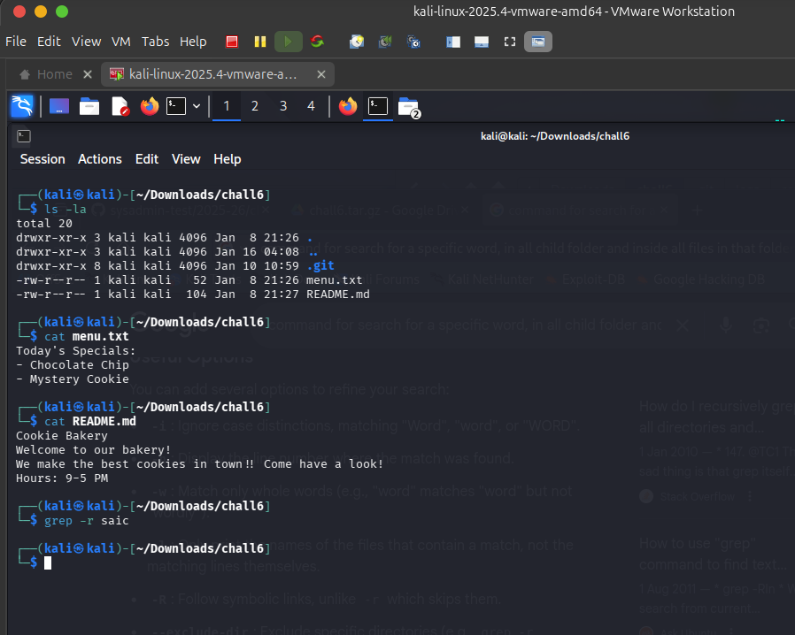
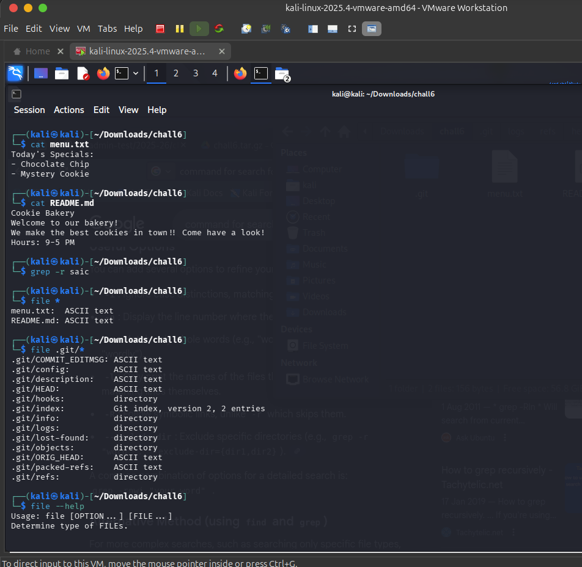
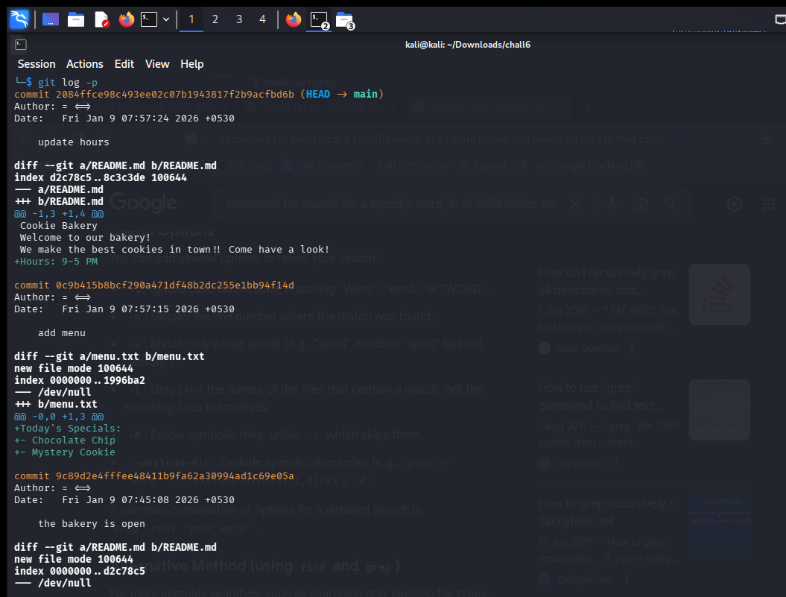
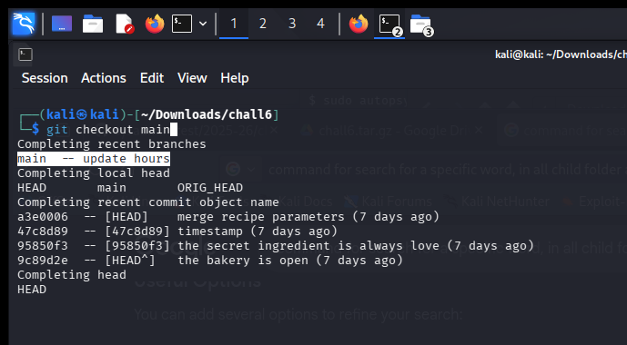
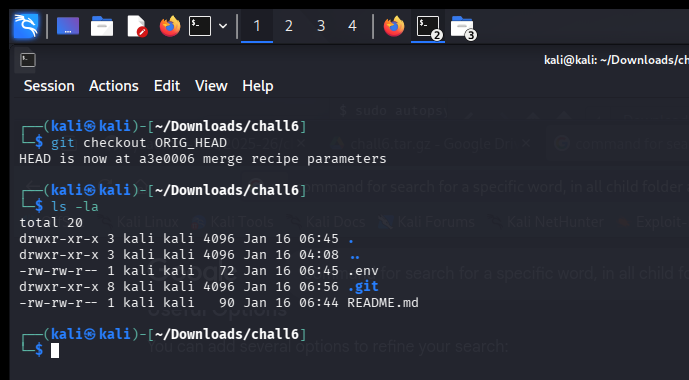
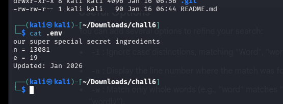
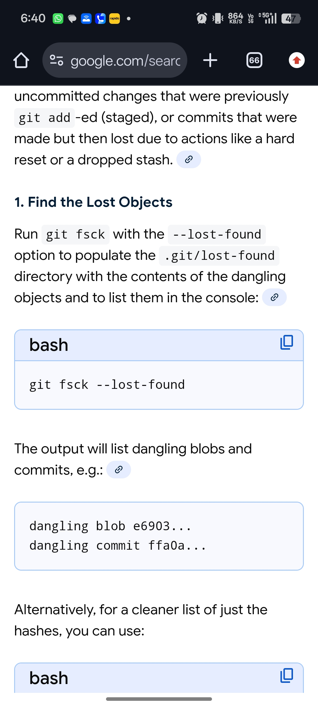
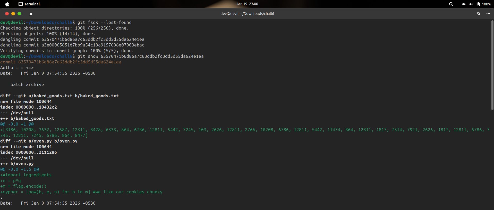

1. First I opened terminal and put the command (ls -la) to check what are the files(hidden) and folders inside the that folder. I got two files and i hidden folder (.git)

2. i read the menu.txt and README but nothing inside that.
      
    

3. When i opened git folder it contains too many files, so reading individual file will take too long, then think about for a command to search individual files. 

4. For that i use "grep -r saic" but it didnt give any result so i realized flag is not directly put in any files (Yah i know it will not be that much easy, but for a corfirmation i did this.)

5. Then i remember about the metadata, which stores info like, when file created, author etc (i saw this in pdf and mp3 files).
6. Then i search for the command to get this metadata. i got the command "file <filename>", then i did this for all files but it just give the file is ASCII etc.
    

7. Then i read the challange instruction one more time, and there i got the word, forensic analysiz, there are some tool in kali for this

8. Since there are too many tool, i search in google, which tool i want to use 

9. then i tried each tool that recommended by google but didnt worked.
    <br!   
10. one more time i read the challange and now i noticed "Folder – Contains the Git repository to be analyzed.".
    So maybe i want to do something with git.
    
11. Then first i check the logs (git log -p)
    there is three commits, and didnt get anything deleted or suspecious.
      
      
    
12. i check for the branches then but only main branch was there

13. but when I put the command "git checkout" and then press tab for autocomplition it shows some other names other than main branch (HEAD, ORIGIN_HEAD)
      
      
14. Then i just checkout that ORIGIN_HEAD, and then listed all files (ls -la) and i got an extra file there called .env :)
    It was so surprising and a cat that file i got some secret there.
      
      
    
15. I just googled what is ORIGIN_HEAD, what i understand is, when we do a reset it stores files as a backup in this 

16. i just look on to the info which is given there. i saw n, e then thought that it will be a RSA encryption key(Public).
        

17. My thought gone like the value of n is small so we can factorize it to prime simply and get the private key.

18. But the cypher is not here. So the next task is to find that. i run the grep -r cypher command but didnt get anything.

19. Then took a tea break with friends, at that time i was googling about the reset command and what does it do and can we restore it and got the command git fsck --lost-found
      

20. The output of that command shows two dangling commit, and to get detailed info about those commit, i just use the command git show and here i got the cypher. :)
        

21. Now i want to dycrypt it, i saw the algo used to encrpt the flag, i put these details in gemini and said to dycrypt it.

22. And i got it SAIC{ev3n_l0g5_cAn_l13_tRu5t_n0_0n3}   => even logs can lie, trust no one.... 
